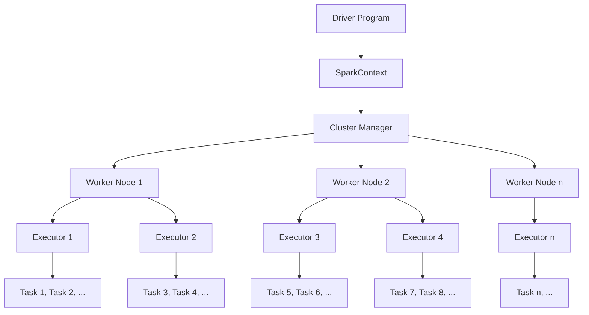
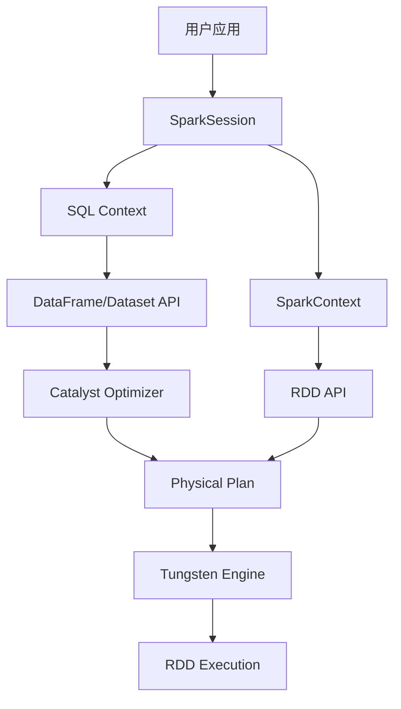
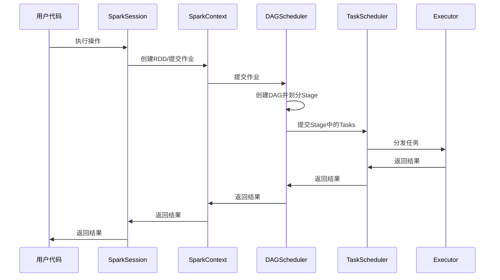
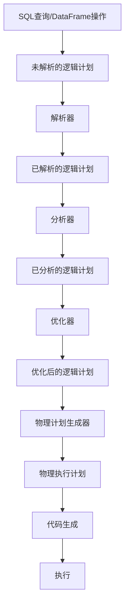
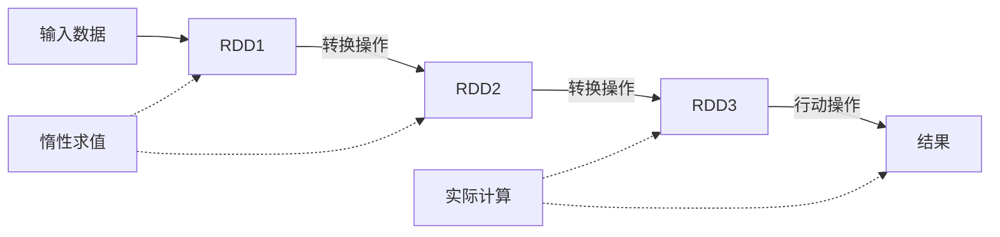
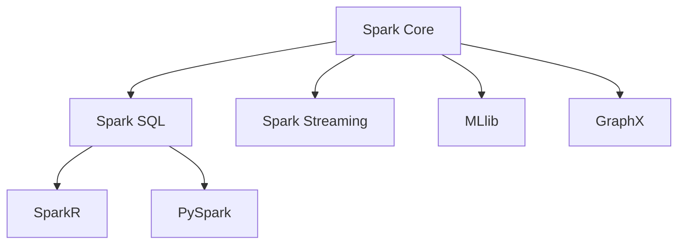

# Spark 项目架构概览

Apache Spark是一个用于大规模数据处理的统一分析引擎。本文档提供了Spark架构的高级概述，包括其核心组件、它们之间的关系以及数据处理流程。

## 1. Spark整体架构

Spark的架构采用了主从(master-slave)模式，主要由以下组件组成：

- **Driver Program**：包含应用程序的main函数，负责创建SparkContext，定义RDD和转换操作，以及提交作业
- **Cluster Manager**：负责资源分配，如YARN、Kubernetes、Mesos或Spark自带的Standalone模式
- **Worker Node**：执行计算任务的工作节点
- **Executor**：在Worker节点上运行的进程，执行任务并存储数据

## 2. 核心组件关系

Spark的核心组件包括：

### 2.1 SparkContext

SparkContext是Spark应用程序的入口点，负责连接到集群管理器、创建RDD、累加器和广播变量。在Spark 2.0之后，SparkSession成为了更高级的入口点，封装了SparkContext。

### 2.2 RDD (弹性分布式数据集)

RDD是Spark的核心抽象，表示可以并行操作的分布式数据集合。RDD具有以下特性：

- 不可变性
- 分区性
- 可并行计算
- 容错性
- 惰性求值

### 2.3 DataFrame和Dataset

DataFrame和Dataset是在RDD之上构建的更高级的抽象：

- **DataFrame**：带有命名列的分布式数据集合，类似于关系型数据库中的表
- **Dataset**：DataFrame的类型安全版本，提供了编译时类型检查

### 2.4 Catalyst优化器

Catalyst是Spark SQL的查询优化框架，负责将SQL查询或DataFrame操作转换为优化的执行计划。

### 2.5 Tungsten执行引擎

Tungsten是Spark的内存管理和二进制处理引擎，通过以下方式优化性能：

- 内存管理优化
- 缓存友好的计算
- 代码生成
- 无GC的内存使用

### 2.6 组件关系图

## 3. 数据处理流程

Spark的数据处理流程可以分为以下几个阶段：

### 3.1 作业提交流程

### 3.2 SQL查询执行流程

### 3.3 RDD转换和执行

RDD操作分为两类：

- **转换操作(Transformations)**：如map、filter、join等，创建新的RDD但不执行计算
- **行动操作(Actions)**：如count、collect、save等，触发实际计算并返回结果

## 4. 模块架构

Spark项目由以下主要模块组成：

- **Spark Core**：基础功能，包括任务调度、内存管理、容错机制等
- **Spark SQL**：用于结构化数据处理的模块，包括SQL引擎和DataFrame API
- **Spark Streaming**：用于实时数据流处理
- **MLlib**：机器学习库
- **GraphX**：图计算引擎
- **SparkR**：R语言接口（已弃用）
- **PySpark**：Python接口

## 5. 资源管理和调度

Spark支持多种集群管理器：

- **Standalone**：Spark自带的简单集群管理器
- **YARN**：Hadoop的资源管理器
- **Kubernetes**：容器编排平台
- **Mesos**：通用集群管理器

调度系统包括：

- **DAGScheduler**：将Spark作业转换为Stage的高级调度器
- **TaskScheduler**：将Stage中的任务分配给Executor的低级调度器
- **SchedulerBackend**：与集群管理器交互的接口
