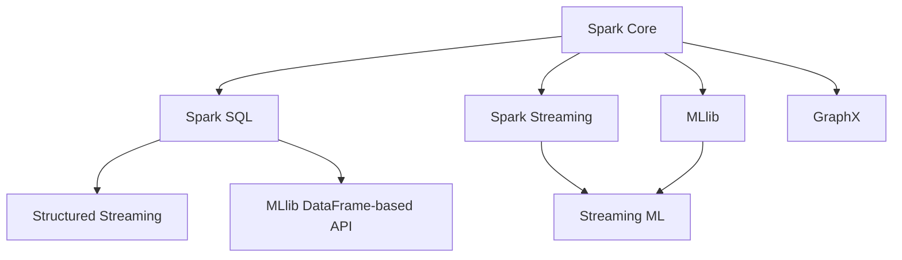
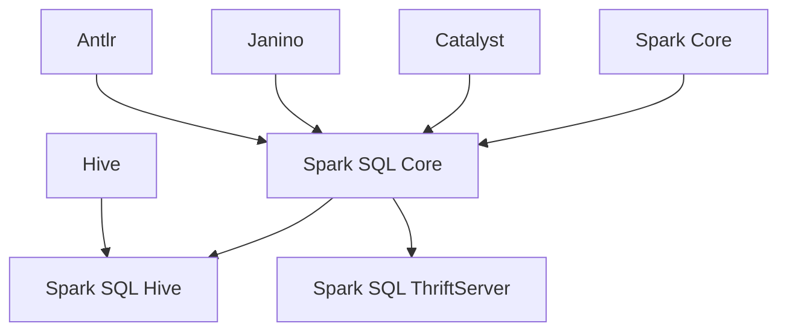
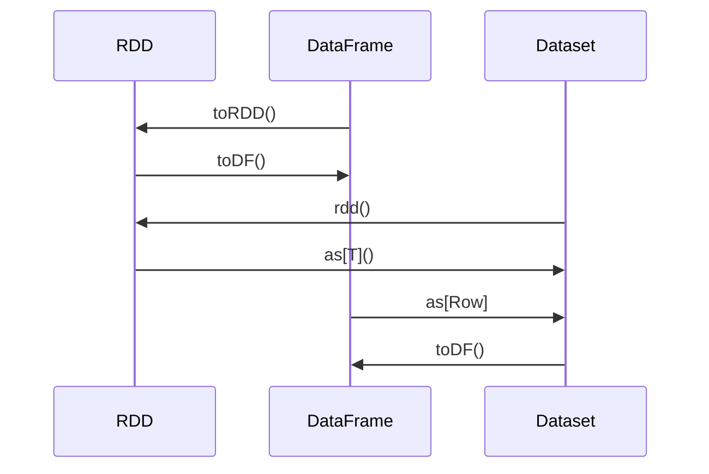
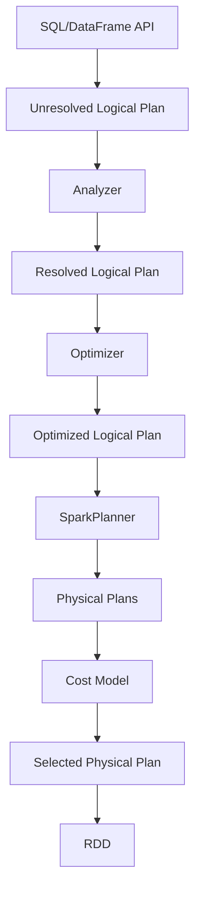
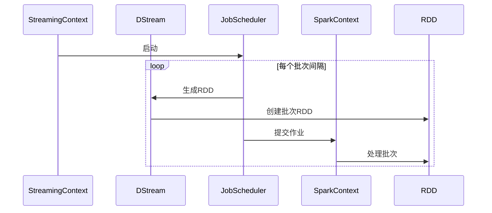
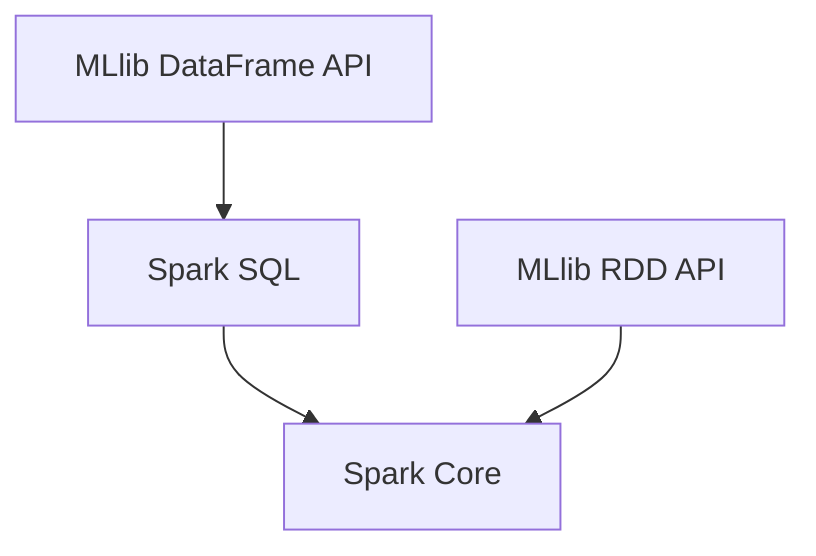
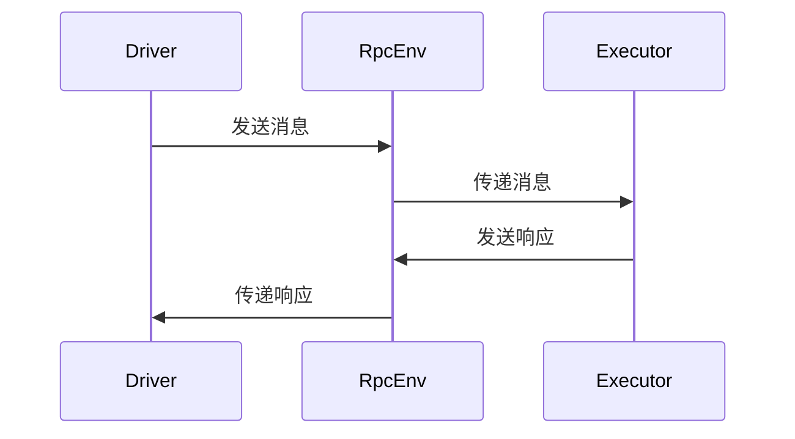
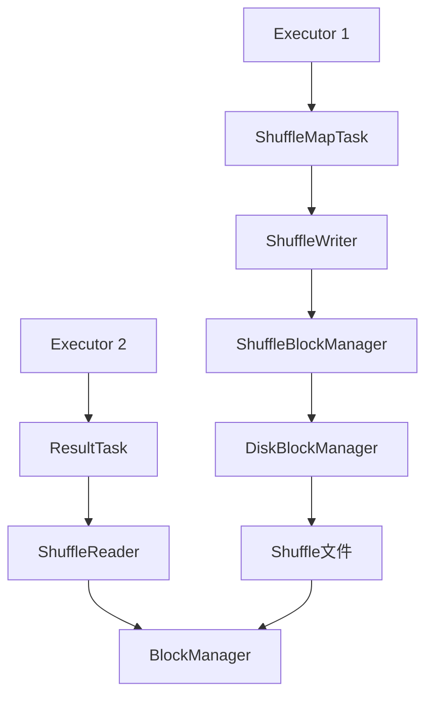

# Spark 关键模块的依赖关系

本文档详细介绍了Apache Spark各个模块之间的依赖关系，以及组件间的交互方式。

## 1. 模块依赖概览

Spark的模块依赖遵循分层架构，从底层到高层依次为：



## 2. 核心模块依赖详解

### 2.1 Spark Core 依赖

Spark Core是最基础的模块，不依赖其他Spark模块，但依赖一些外部库：

- Netty：网络通信
- Kryo：序列化
- Guava：通用工具
- Metrics：度量收集
- Log4j/Slf4j：日志记录

### 2.2 Spark SQL 依赖

Spark SQL依赖：

- Spark Core：基础计算引擎
- Catalyst：查询优化框架
- Janino：代码生成
- Antlr：SQL解析
- Jackson：JSON处理



### 2.3 Spark Streaming 依赖

Spark Streaming依赖：

- Spark Core：基础计算引擎
- ZooKeeper（可选）：状态管理

### 2.4 MLlib 依赖

MLlib依赖：

- Spark Core：基础计算引擎
- Breeze：数值计算
- Spark SQL（对于DataFrame-based API）

### 2.5 GraphX 依赖

GraphX依赖：

- Spark Core：基础计算引擎

## 3. 组件间交互方式

### 3.1 RDD与DataFrame/Dataset交互

RDD是Spark的基础抽象，DataFrame/Dataset构建在RDD之上。它们之间的交互如下：



主要交互方法：

- `DataFrame.rdd`/`DataFrame.toRDD()`：将DataFrame转换为RDD[Row]
- `SparkSession.createDataFrame(rdd)`：将RDD转换为DataFrame
- `Dataset.rdd`：将Dataset转换为RDD
- `rdd.toDS()`：将RDD转换为Dataset（需要隐式编码器）

### 3.2 Spark SQL与Catalyst交互

Spark SQL通过Catalyst优化器处理查询：



主要交互组件：

- `QueryExecution`：协调查询执行过程
- `LogicalPlan`：表示SQL查询的逻辑计划
- `SparkPlan`：表示物理执行计划
- `Rule`：转换规则，用于优化查询

### 3.3 Spark Streaming与Spark Core交互

Spark Streaming将流处理转换为一系列批处理作业：



主要交互组件：

- `StreamingContext`：流处理入口点
- `JobScheduler`：调度流处理作业
- `DStream`：表示连续的RDD序列
- `ReceiverTracker`：管理数据接收器

### 3.4 MLlib与Spark Core/SQL交互

MLlib有两套API：

1. RDD-based API（旧）：直接使用RDD
2. DataFrame-based API（新）：使用DataFrame/Dataset



主要交互组件：

- `Estimator`/`Transformer`/`Pipeline`：ML API的核心抽象
- `VectorAssembler`：特征工程组件，将DataFrame列转换为特征向量
- `MLWriter`/`MLReader`：模型序列化/反序列化

## 4. 扩展点设计

Spark提供了多个扩展点，允许用户自定义功能：

### 4.1 数据源API

Spark SQL的数据源API允许实现自定义数据源：

- `DataSourceRegister`：注册数据源
- `RelationProvider`：创建基本关系
- `CreatableRelationProvider`：支持写入的关系
- `StreamSourceProvider`：流数据源
- `StreamSinkProvider`：流数据接收器

### 4.2 自定义优化器规则

可以通过`SparkSessionExtensions`添加自定义优化规则：

```scala
spark.withExtensions { extensions =>
  extensions.injectOptimizerRule { session =>
    new MyCustomRule(session)
  }
}
```

### 4.3 自定义函数

Spark支持多种自定义函数：

- UDF (User Defined Function)：自定义标量函数
- UDAF (User Defined Aggregate Function)：自定义聚合函数
- UDTF (User Defined Table Function)：自定义表函数

### 4.4 自定义调度器

可以通过实现`SchedulerBackend`和`TaskScheduler`接口来自定义调度行为。

## 5. 模块间通信机制

### 5.1 Driver与Executor通信

Driver与Executor之间通过RPC（Remote Procedure Call）进行通信：



主要通信组件：

- `RpcEnv`：RPC环境
- `RpcEndpoint`：RPC端点
- `RpcEndpointRef`：RPC端点引用

### 5.2 Executor间通信

Executor之间主要通过Shuffle进行数据交换：



主要通信组件：

- `ShuffleManager`：管理Shuffle过程
- `BlockManager`：管理数据块
- `NettyBlockTransferService`：通过网络传输数据块

## 6. 依赖管理策略

Spark使用以下策略管理依赖：

### 6.1 传递依赖排除

Spark排除一些传递依赖，以避免版本冲突：

```scala
// 在build.sbt中
libraryDependencies += "org.apache.hadoop" % "hadoop-client" % "3.3.1" excludeAll(
  ExclusionRule(organization = "org.slf4j"),
  ExclusionRule(organization = "javax.servlet")
)
```

### 6.2 Shaded依赖

Spark对一些依赖进行shading处理，将包重命名以避免冲突：

```
org.apache.curator -> org.apache.spark.shaded.curator
```

### 6.3 可选依赖

Spark将一些依赖标记为"provided"，期望由用户或部署环境提供：

```scala
libraryDependencies += "org.apache.hadoop" % "hadoop-client" % "3.3.1" % "provided"
```
