# Spark 数据流向

本文档详细介绍了Apache Spark中的数据流向，包括数据读取、转换处理和结果输出的完整流程。

## 1. RDD数据流

### 1.1 RDD创建流程

RDD可以通过多种方式创建：

1. **从外部存储系统读取**：
   - 本地文件系统
   - HDFS
   - HBase
   - 各种数据库

2. **从内存中的集合创建**：
   - `parallelize()`方法

3. **从其他RDD转换而来**：
   - 通过转换操作

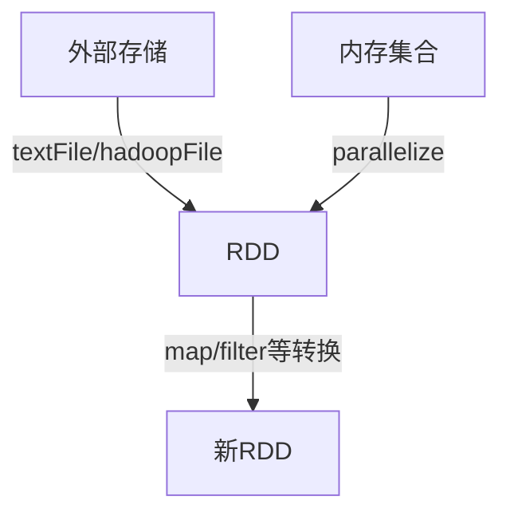

### 1.2 RDD转换执行流程

RDD操作分为两类：

1. **转换操作(Transformations)**：创建新的RDD，但不执行计算
2. **行动操作(Actions)**：触发计算并返回结果

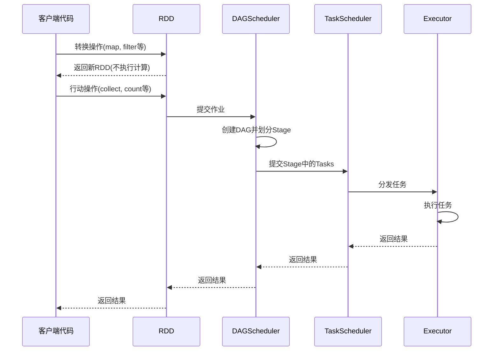

### 1.3 RDD依赖关系

RDD之间的依赖关系分为两种：

1. **窄依赖(Narrow Dependency)**：父RDD的每个分区最多被一个子RDD的分区使用
2. **宽依赖(Wide Dependency)**：父RDD的分区可能被多个子RDD的分区使用，需要Shuffle

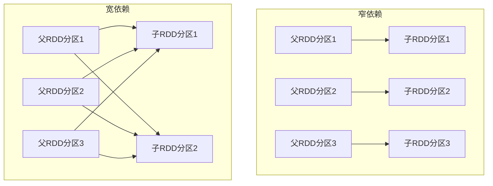

### 1.4 Stage划分

DAGScheduler根据RDD的依赖关系将作业划分为多个Stage：

- 在宽依赖处划分Stage
- 每个Stage包含一系列窄依赖的转换操作
- Stage按照依赖关系顺序执行

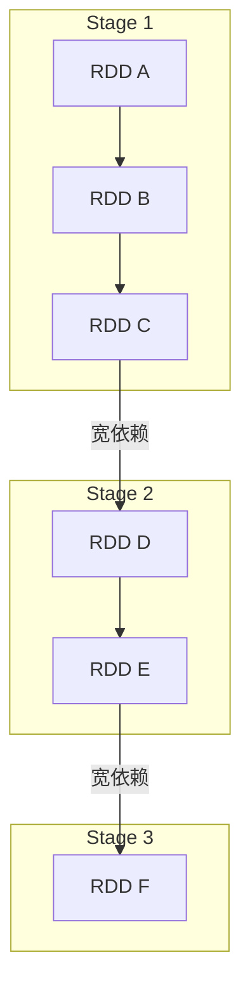

## 2. SQL/DataFrame数据流

### 2.1 SQL查询执行流程

SQL查询的执行流程如下：

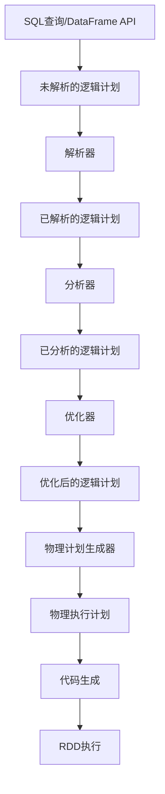

### 2.2 Catalyst优化器流程

Catalyst优化器是Spark SQL的核心组件，负责优化查询计划：

1. **解析(Parse)**：将SQL文本解析为未解析的逻辑计划
2. **分析(Analyze)**：解析引用和数据类型
3. **优化(Optimize)**：应用基于规则的优化
4. **物理计划(Physical Planning)**：生成物理执行计划

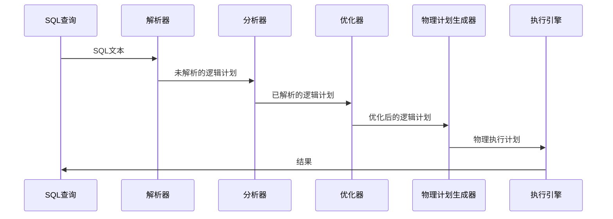

### 2.3 优化规则

Catalyst优化器应用多种优化规则：

1. **谓词下推(Predicate Pushdown)**：将过滤条件尽早应用
2. **列剪裁(Column Pruning)**：只读取需要的列
3. **常量折叠(Constant Folding)**：预计算常量表达式
4. **连接重排序(Join Reordering)**：优化连接顺序
5. **分区裁剪(Partition Pruning)**：只读取需要的分区

### 2.4 代码生成

Spark SQL使用Whole-Stage Code Generation技术优化执行：

1. 将多个操作符融合为单个函数
2. 减少虚函数调用和对象创建
3. 利用CPU缓存和寄存器
4. 减少内存访问

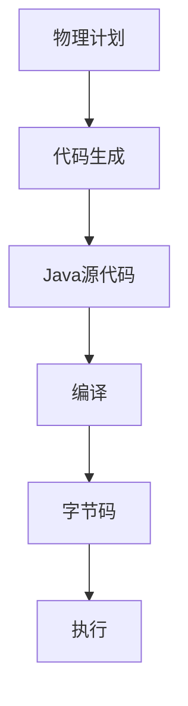

## 3. 流处理数据流

### 3.1 Spark Streaming (DStream)

Spark Streaming将流处理转换为一系列小批量处理：

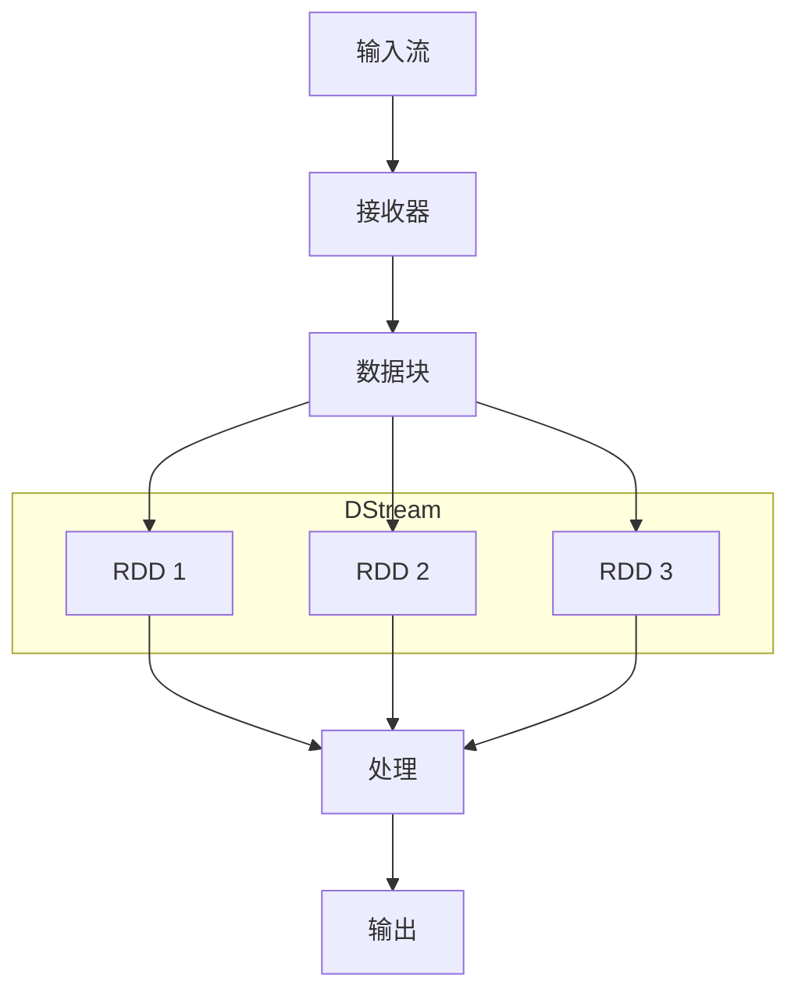

### 3.2 Structured Streaming

Structured Streaming是基于Spark SQL引擎的流处理模型：

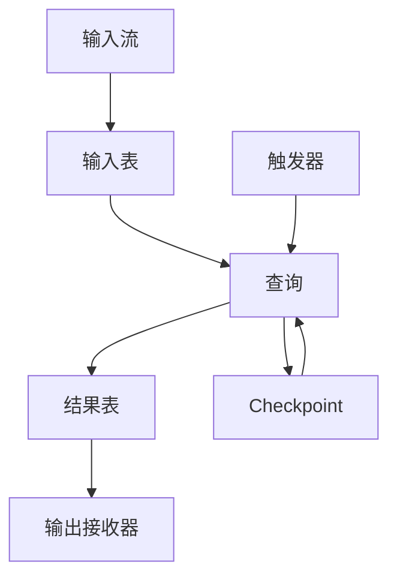

处理模式：

1. **微批处理(Micro-Batch Processing)**：定期处理小批量数据
2. **连续处理(Continuous Processing)**：低延迟处理每条记录

## 4. 数据读取流程

### 4.1 文件读取流程

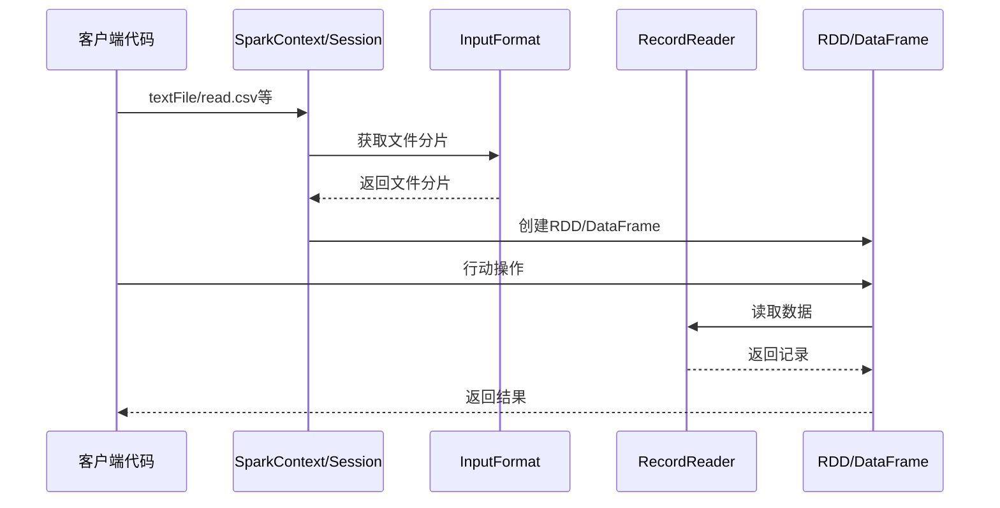

### 4.2 数据源API

Spark SQL提供了DataSource API，支持多种数据源：

1. **内置数据源**：
   - CSV
   - JSON
   - Parquet
   - ORC
   - JDBC

2. **自定义数据源**：
   - 实现DataSourceV2接口
   - 提供读写能力

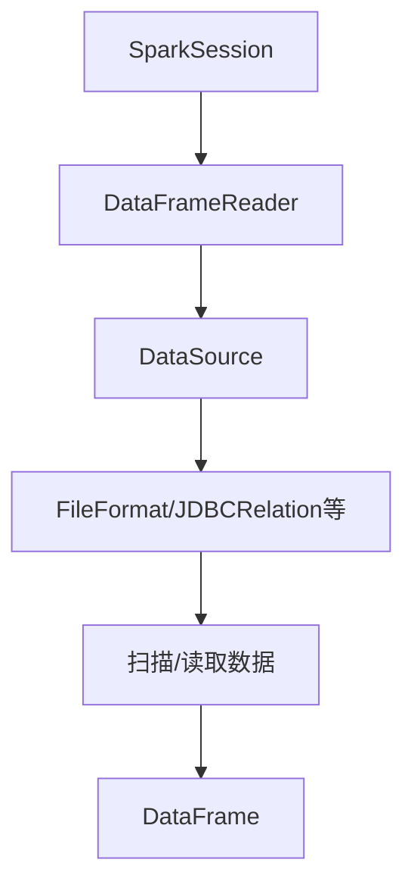

## 5. 结果输出流程

### 5.1 RDD结果输出

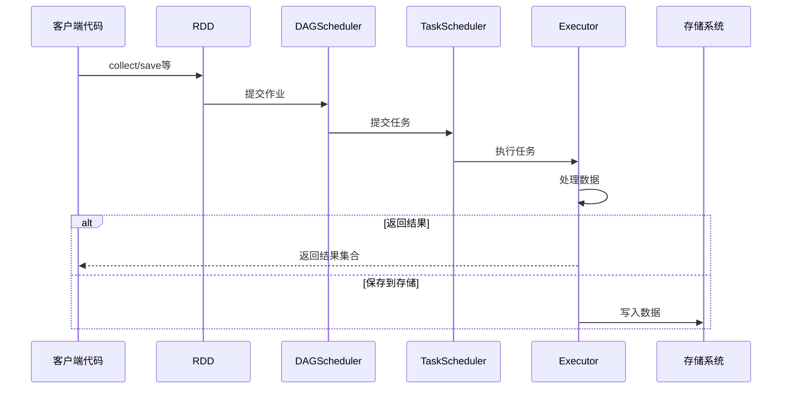

### 5.2 DataFrame/Dataset结果输出

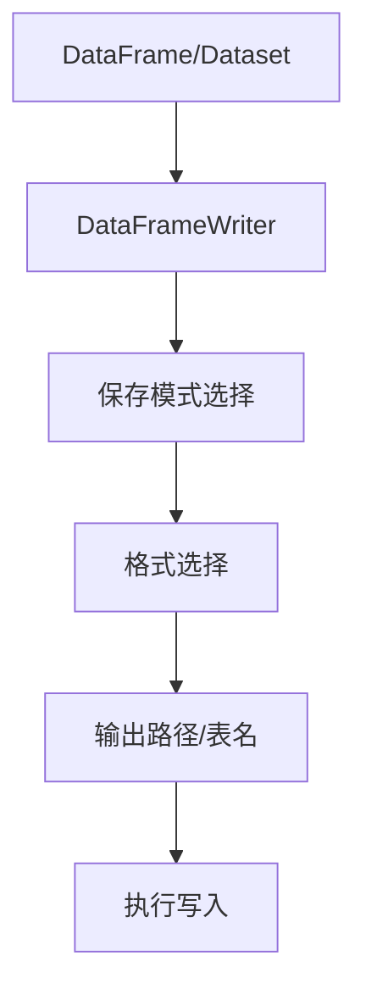

保存模式：

1. **error**：如果数据已存在则报错（默认）
2. **append**：追加到现有数据
3. **overwrite**：覆盖现有数据
4. **ignore**：如果数据已存在则忽略

### 5.3 流处理结果输出

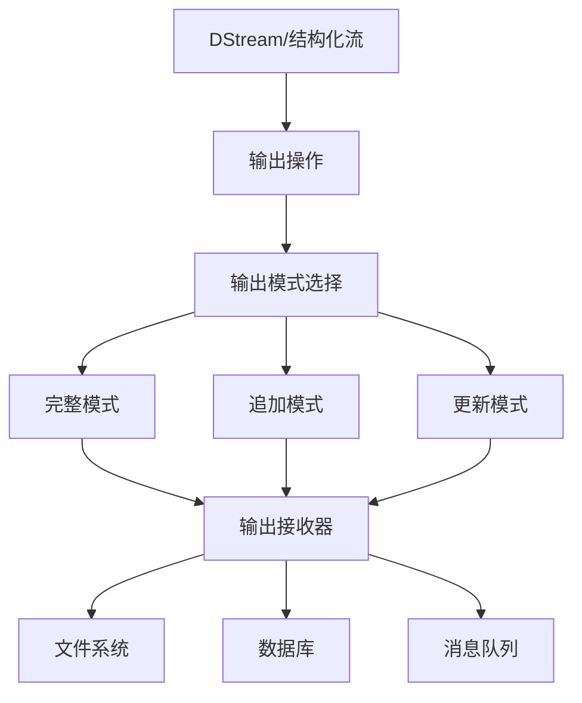

输出模式：

1. **完整模式(Complete Mode)**：输出整个结果表
2. **追加模式(Append Mode)**：只输出新增的行
3. **更新模式(Update Mode)**：只输出更新的行
