# Spark 核心组件执行流程

本文档详细介绍了Apache Spark中核心组件的执行流程，包括任务提交、作业调度和执行阶段。

## 1. 任务提交流程

### 1.1 应用程序提交过程

Spark应用程序的提交过程如下：

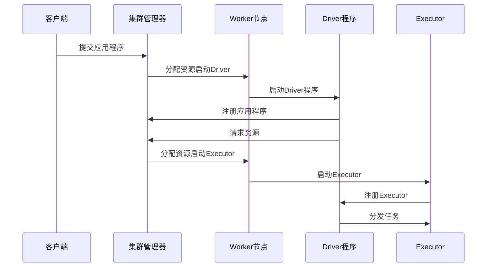

### 1.2 不同部署模式

Spark支持三种部署模式：

1. **客户端模式(Client Mode)**：
   - Driver程序在提交应用的客户端运行
   - 适合交互式应用和调试

2. **集群模式(Cluster Mode)**：
   - Driver程序在集群中的Worker节点上运行
   - 适合生产环境

3. **本地模式(Local Mode)**：
   - 所有组件在单机上运行
   - 适合开发和测试

### 1.3 资源分配过程

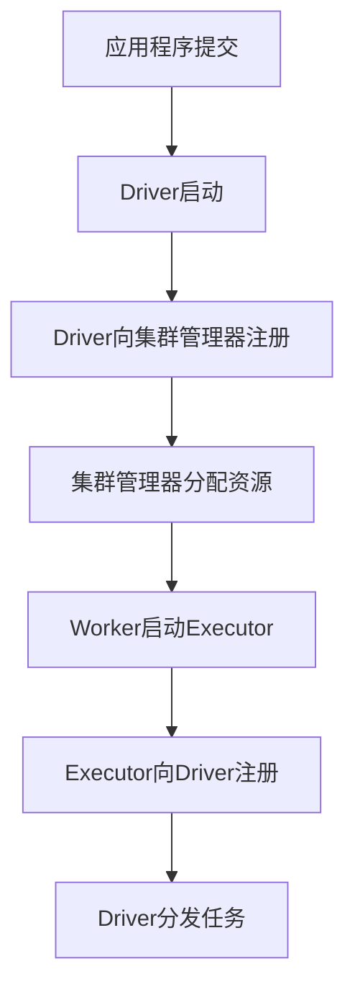

资源分配参数：

- `--num-executors`：Executor数量
- `--executor-cores`：每个Executor的CPU核心数
- `--executor-memory`：每个Executor的内存
- `--driver-memory`：Driver内存

## 2. 作业调度过程

### 2.1 从RDD到物理执行计划

当在RDD上调用行动操作时，Spark会创建执行计划：

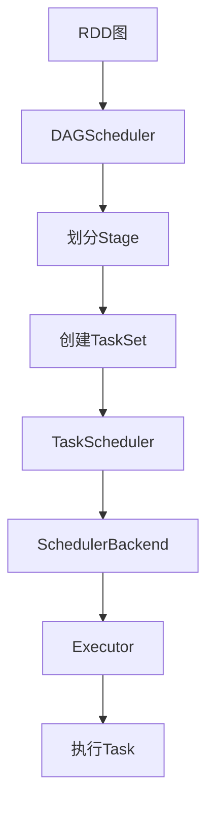

### 2.2 DAGScheduler工作流程

DAGScheduler是Spark的高级调度器，负责将RDD操作转换为Stage。

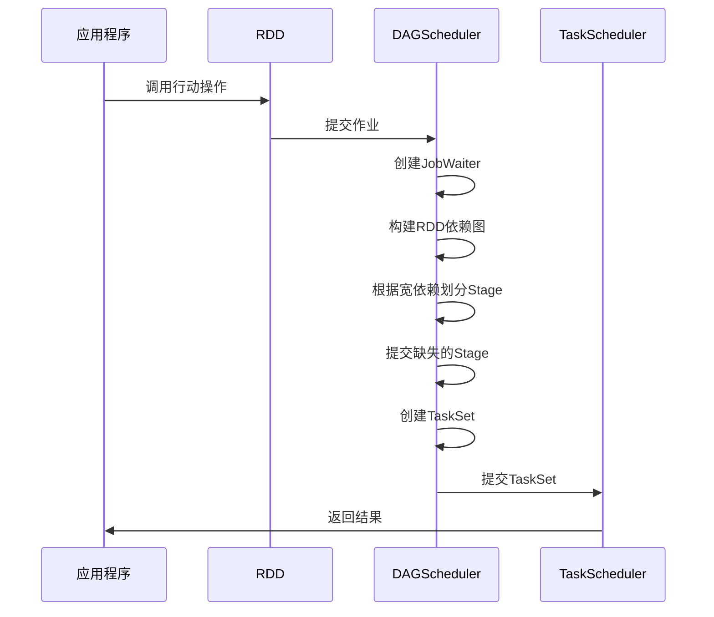

DAGScheduler的主要职责：

1. 根据RDD的依赖关系构建DAG
2. 在宽依赖处划分Stage
3. 确定Stage之间的依赖关系
4. 将Stage转换为TaskSet
5. 处理任务失败和重试

### 2.3 TaskScheduler工作流程

TaskScheduler是Spark的低级调度器，负责将TaskSet中的任务分配给Executor。

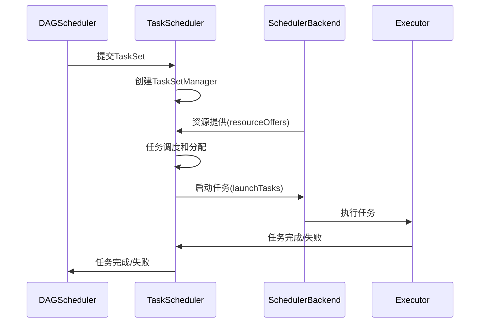

TaskScheduler的主要职责：

1. 维护待执行的TaskSet队列
2. 根据调度策略分配任务
3. 监控任务执行状态
4. 处理任务失败和重试
5. 实现任务本地性优化

### 2.4 调度策略

Spark支持多种调度策略：

1. **FIFO调度(FIFO Scheduling)**：
   - 按照作业提交顺序执行
   - 简单但可能导致小作业等待时间长

2. **公平调度(Fair Scheduling)**：
   - 在多个作业之间公平分配资源
   - 支持作业池和权重

配置调度策略：

```
spark.scheduler.mode=FAIR
```

## 3. 执行阶段详解

### 3.1 Stage划分

Spark根据RDD的依赖关系将作业划分为多个Stage：

1. **依赖类型**：
   - **窄依赖(Narrow Dependency)**：父RDD的每个分区最多被一个子RDD的分区使用
   - **宽依赖(Wide Dependency)**：父RDD的分区可能被多个子RDD的分区使用，需要Shuffle

2. **Stage类型**：
   - **ShuffleMapStage**：产生Shuffle数据的Stage
   - **ResultStage**：返回结果的Stage

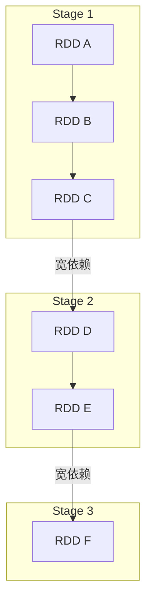

### 3.2 Task创建和执行

每个Stage包含多个Task，每个Task处理一个RDD分区：

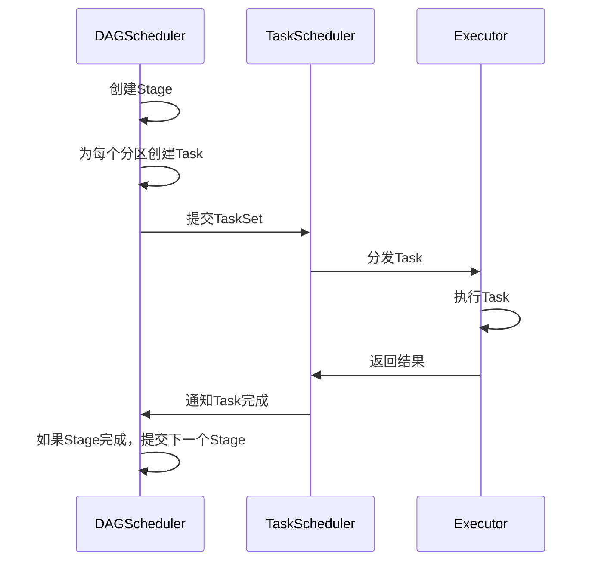

Task类型：

1. **ShuffleMapTask**：执行ShuffleMapStage中的任务，产生Shuffle数据
2. **ResultTask**：执行ResultStage中的任务，返回结果给Driver

### 3.3 Shuffle过程

Shuffle是Spark中最复杂和最昂贵的操作，涉及数据的重新分区和网络传输。

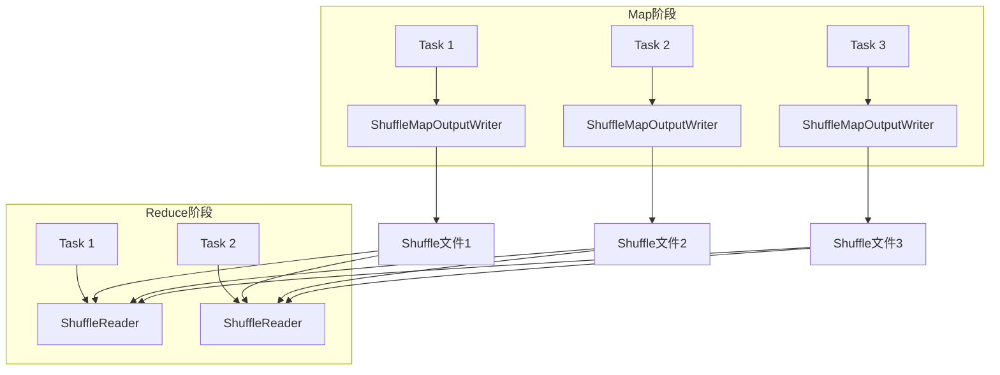

Shuffle过程：

1. **Map阶段**：
   - 每个Mapper任务计算结果并按照分区写入本地磁盘
   - 使用ShuffleWriter将数据写入分区文件

2. **Reduce阶段**：
   - 每个Reducer任务从所有Mapper获取对应分区的数据
   - 使用ShuffleReader读取和合并数据

Shuffle实现：

1. **Hash Shuffle**：简单但可能产生大量小文件
2. **Sort Shuffle**：排序数据并合并文件，减少文件数量
3. **Tungsten Sort Shuffle**：内存优化版本的Sort Shuffle

### 3.4 任务执行详情

Task在Executor上的执行流程：

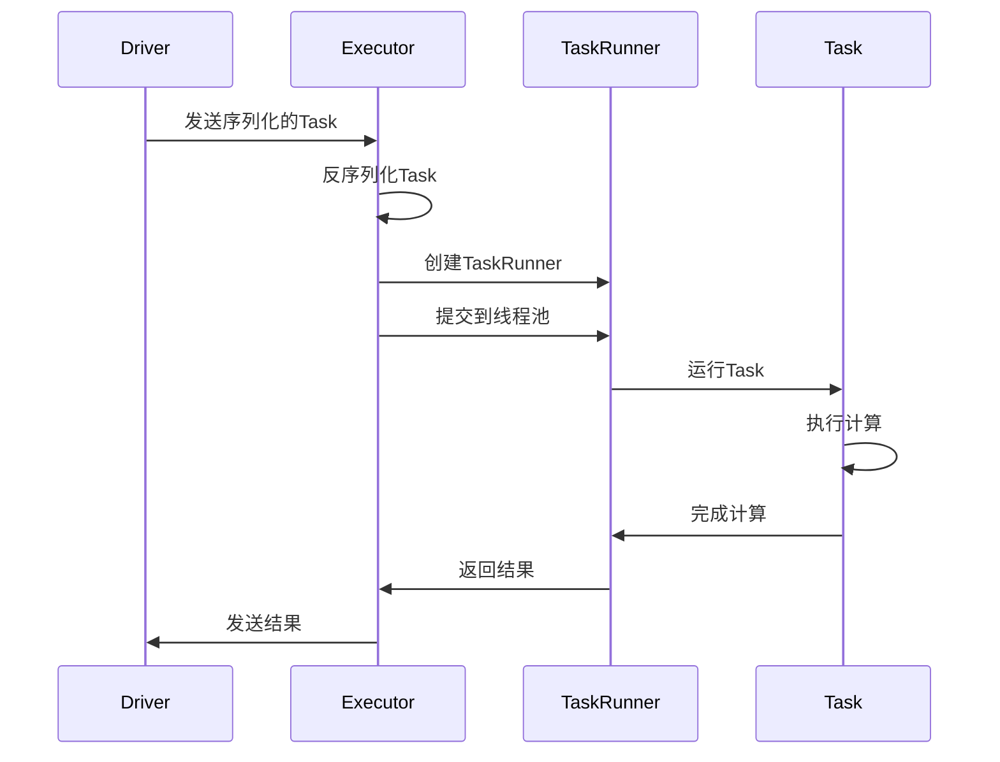

Task执行阶段：

1. **任务反序列化**：反序列化Task及其依赖
2. **执行准备**：设置上下文和资源
3. **运行计算**：执行实际计算
4. **结果处理**：序列化结果并返回给Driver

## 4. SQL查询执行流程

### 4.1 SQL解析和优化

Spark SQL查询的执行流程：

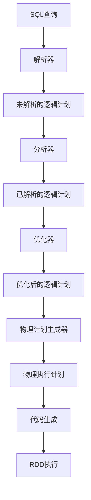

### 4.2 物理计划生成

SparkPlanner将逻辑计划转换为物理计划：

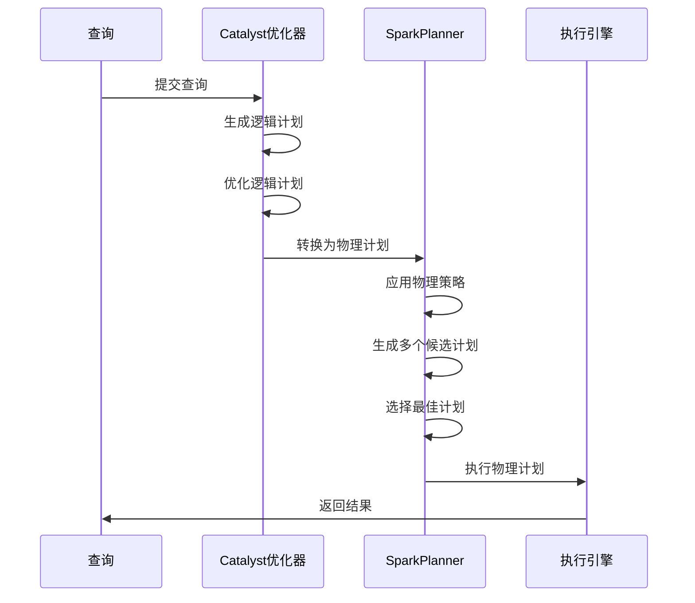

物理策略包括：

- DataSourceStrategy：处理数据源
- JoinSelection：选择最佳连接算法
- Aggregation：优化聚合操作
- SpecialLimits：优化LIMIT操作
- InMemoryScans：处理缓存数据

### 4.3 Whole-Stage Code Generation

Spark SQL使用Whole-Stage Code Generation技术优化执行：

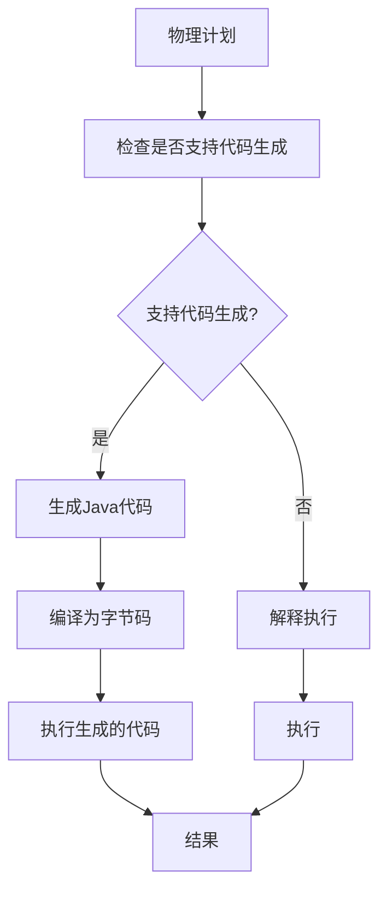

代码生成优势：

1. 减少虚函数调用
2. 减少内存访问
3. CPU缓存友好
4. 允许JIT优化

## 5. 流处理执行流程

### 5.1 Spark Streaming (DStream)

Spark Streaming将流处理转换为一系列小批量处理：

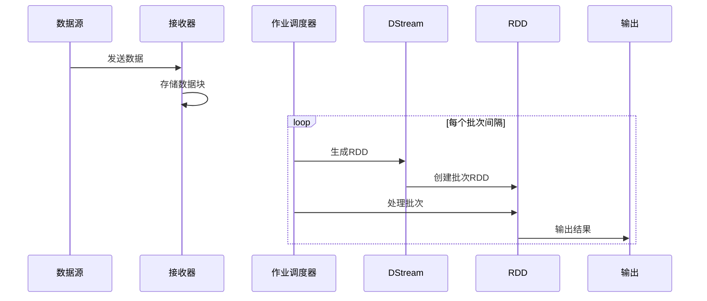

### 5.2 Structured Streaming

Structured Streaming是基于Spark SQL引擎的流处理模型：

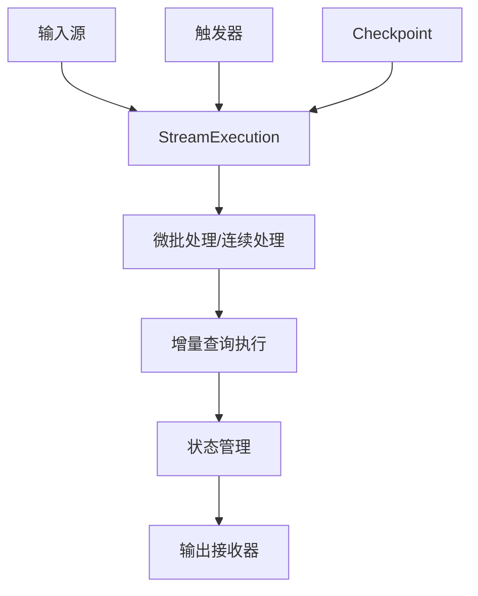

执行模式：

1. **微批处理(Micro-Batch Processing)**：
   - 定期处理小批量数据
   - 使用MicroBatchExecution实现
   - 提供端到端一次性语义

2. **连续处理(Continuous Processing)**：
   - 低延迟处理每条记录
   - 使用ContinuousExecution实现
   - 提供至少一次语义
