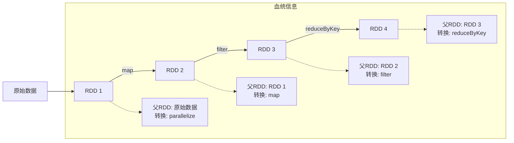
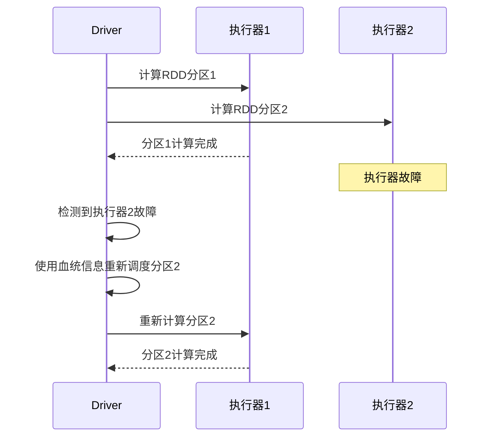
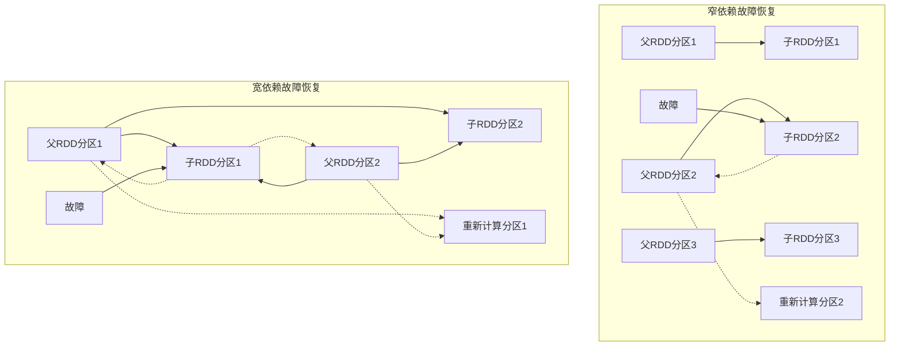
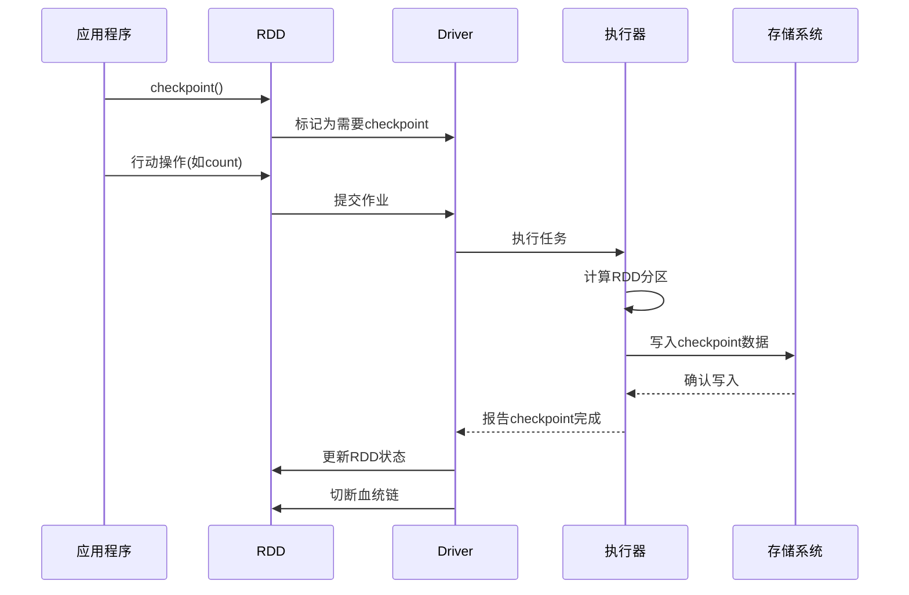
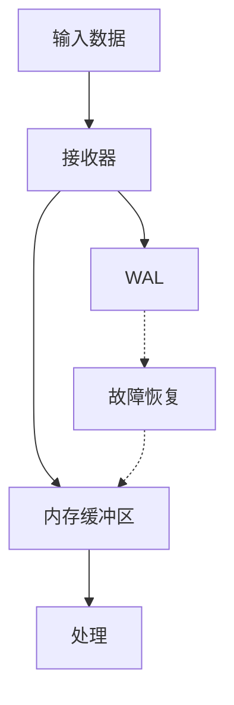
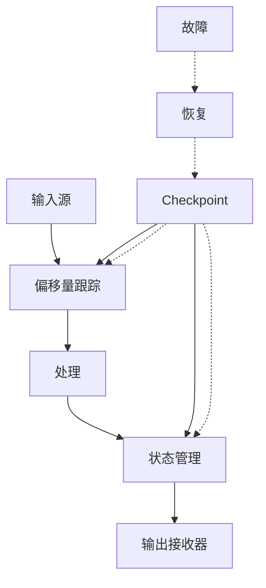
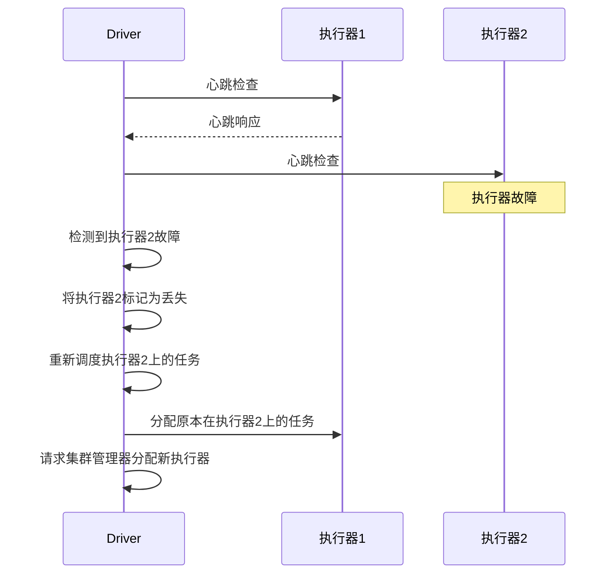
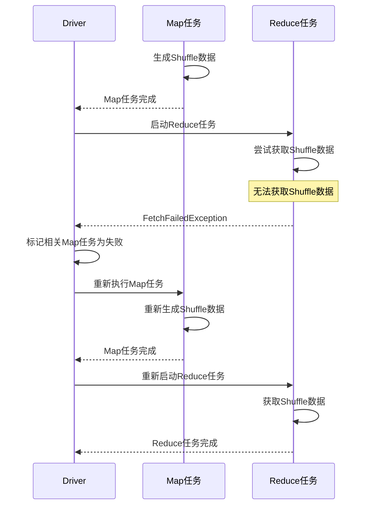

# Spark 故障恢复机制

本文档详细介绍了Apache Spark的故障恢复机制，包括RDD容错、Checkpoint机制和WAL(预写日志)机制。

## 1. RDD容错机制

### 1.1 RDD的不变性和血统(Lineage)

RDD的核心容错机制基于两个关键特性：

1. **不变性(Immutability)**：RDD一旦创建就不可修改，这避免了并发修改带来的一致性问题。

2. **血统(Lineage)**：RDD记录了它是如何从其他RDD转换而来的完整信息，包括：
   - 父RDD
   - 应用于父RDD的转换操作
   - 分区信息



### 1.2 RDD重新计算机制

当RDD的某个分区数据丢失时（如执行器故障），Spark可以使用血统信息重新计算该分区：



重新计算过程：

1. Driver检测到执行器故障或任务失败
2. 查找受影响的RDD分区
3. 根据血统信息确定重新计算路径
4. 将任务重新调度到可用执行器
5. 执行重新计算

### 1.3 窄依赖与宽依赖的影响

RDD依赖类型对故障恢复有重要影响：

1. **窄依赖(Narrow Dependency)**：
   - 父RDD的每个分区最多被一个子RDD的分区使用
   - 故障恢复只需重新计算失败的分区
   - 恢复速度快，影响范围小

2. **宽依赖(Wide Dependency)**：
   - 父RDD的分区可能被多个子RDD的分区使用
   - 故障恢复可能需要重新计算多个分区
   - 恢复开销较大



## 2. Checkpoint机制

### 2.1 Checkpoint的必要性

虽然血统机制可以恢复丢失的RDD分区，但在以下情况下可能存在问题：

1. **血统链过长**：重新计算成本高
2. **宽依赖多**：需要重新计算大量分区
3. **迭代算法**：每次迭代都增加血统长度

Checkpoint通过将RDD数据保存到可靠存储系统（如HDFS）来解决这些问题，切断血统链，提供更高效的恢复机制。

### 2.2 Checkpoint类型

Spark支持两种Checkpoint类型：

1. **可靠Checkpoint(Reliable Checkpoint)**：
   - 将RDD数据写入外部存储系统（如HDFS）
   - 完全切断血统链
   - 提供跨应用程序的恢复能力
   - 使用`RDD.checkpoint()`方法

2. **本地Checkpoint(Local Checkpoint)**：
   - 将RDD数据写入执行器的本地存储
   - 部分切断血统链
   - 只提供应用程序内的恢复能力
   - 使用`RDD.localCheckpoint()`方法

### 2.3 Checkpoint实现流程



Checkpoint实现步骤：

1. 调用`RDD.checkpoint()`标记RDD需要checkpoint
2. 执行行动操作触发RDD计算
3. 计算完成后，将RDD数据写入存储系统
4. 更新RDD状态，切断血统链
5. 后续使用时直接从checkpoint数据读取

### 2.4 Checkpoint代码示例

```scala
// 设置checkpoint目录
sc.setCheckpointDir("hdfs://checkpoint-dir")

// 创建RDD并执行转换
val rdd = sc.textFile("data.txt")
val processed = rdd.map(...).filter(...).groupByKey(...)

// 标记需要checkpoint
processed.checkpoint()

// 触发计算和checkpoint
processed.count()

// 后续使用checkpoint数据
val result = processed.map(...)
```

## 3. WAL(预写日志)机制

### 3.1 流处理中的WAL

Spark Streaming使用WAL(Write Ahead Log)机制确保数据不会因故障而丢失。

WAL的工作原理：

1. 接收到的数据在写入内存之前先写入日志
2. 发生故障时，可以从日志中恢复数据
3. 提供"精确一次"(exactly-once)处理语义



### 3.2 WAL配置

在Spark Streaming中配置WAL：

```scala
// 启用WAL
val conf = new SparkConf()
  .set("spark.streaming.receiver.writeAheadLog.enable", "true")

// 配置WAL目录
conf.set("spark.streaming.receiver.writeAheadLog.logDirectory", 
  "hdfs://wal-directory")
```

### 3.3 WAL实现细节

WAL的实现位于`org.apache.spark.streaming.util.WriteAheadLog`：

```scala
// WAL接口
trait WriteAheadLog {
  // 写入记录
  def write(record: ByteBuffer, time: Long): WriteAheadLogRecordHandle
  
  // 读取记录
  def read(handle: WriteAheadLogRecordHandle): ByteBuffer
  
  // 读取批次
  def readAll(): util.Iterator[ByteBuffer]
  
  // 清理旧日志
  def clean(threshTime: Long, waitForCompletion: Boolean): Unit
}

// 基于文件的WAL实现
class FileBasedWriteAheadLog(
    conf: SparkConf,
    logDirectory: String,
    hadoopConf: Configuration,
    rollingIntervalSecs: Int,
    maxFailures: Int,
    closeFileAfterWrite: Boolean
  ) extends WriteAheadLog {
  
  // 实现...
}
```

WAL写入流程：

1. 接收器接收数据
2. 将数据序列化为ByteBuffer
3. 调用WAL的write方法写入日志
4. 写入成功后，将数据存入内存
5. 定期滚动日志文件

WAL恢复流程：

1. 应用程序重启后，检测到之前的WAL文件
2. 读取WAL中的所有记录
3. 重新处理这些记录
4. 恢复到故障前的状态

## 4. Structured Streaming的容错机制

### 4.1 Checkpoint与状态恢复

Structured Streaming使用checkpoint来保存：

1. **查询进度信息**：处理的偏移量
2. **运行聚合状态**：聚合操作的中间结果

```scala
// 配置checkpoint
val query = df.writeStream
  .outputMode("complete")
  .option("checkpointLocation", "path/to/checkpoint/dir")
  .format("console")
  .start()
```

### 4.2 端到端一次性语义

Structured Streaming提供端到端一次性(exactly-once)语义，通过：

1. **可重放的源(Replayable Sources)**：如Kafka，可以从特定偏移量重放
2. **幂等写入(Idempotent Sinks)**：确保重复写入不会导致重复数据
3. **事务支持**：某些接收器支持事务写入



## 5. 高可用性机制

### 5.1 Driver高可用

Spark支持Driver的高可用性，防止Driver故障导致应用程序失败：

1. **Standalone模式**：
   - 使用ZooKeeper实现Master高可用
   - 配置备用Master节点
   - 自动故障转移

   ```scala
   // 配置Standalone高可用
   val conf = new SparkConf()
     .set("spark.deploy.recoveryMode", "ZOOKEEPER")
     .set("spark.deploy.zookeeper.url", "zk1:2181,zk2:2181")
   ```

2. **YARN模式**：
   - 应用程序管理器(ApplicationMaster)故障时自动重启
   - 保留执行器和任务状态

   ```scala
   // 启用YARN AM高可用
   val conf = new SparkConf()
     .set("spark.yarn.maxAppAttempts", "4")
   ```

3. **Kubernetes模式**：
   - Pod故障时自动重启
   - 使用持久卷保存状态

### 5.2 Executor故障处理

Executor故障处理机制：

1. **检测机制**：
   - 心跳超时
   - 执行器主动报告故障

2. **恢复策略**：
   - 重新分配任务到其他执行器
   - 根据需要重新计算丢失的RDD分区
   - 可选择启动新的执行器替代故障执行器



### 5.3 Shuffle数据丢失处理

Shuffle数据丢失的处理机制：

1. **检测机制**：
   - Reducer任务无法获取Shuffle数据
   - 抛出FetchFailedException

2. **恢复策略**：
   - 重新计算丢失的Mapper任务
   - 重新生成Shuffle数据
   - 重试Reducer任务



### 5.4 任务失败处理

任务失败的处理机制：

1. **失败类型**：
   - 非致命错误：可以重试任务
   - 致命错误：导致Stage失败

2. **重试策略**：
   - 任务重试次数由`spark.task.maxFailures`控制（默认4次）
   - 超过最大重试次数后，整个Stage失败
   - Stage失败后，可能导致Job失败

3. **推测执行**：
   - 检测运行缓慢的任务
   - 在其他执行器上启动相同任务的副本
   - 采用先完成的任务结果

```scala
// 配置任务失败重试
val conf = new SparkConf()
  .set("spark.task.maxFailures", "8")

// 启用推测执行
conf.set("spark.speculation", "true")
conf.set("spark.speculation.quantile", "0.75")
conf.set("spark.speculation.multiplier", "1.5")
```
