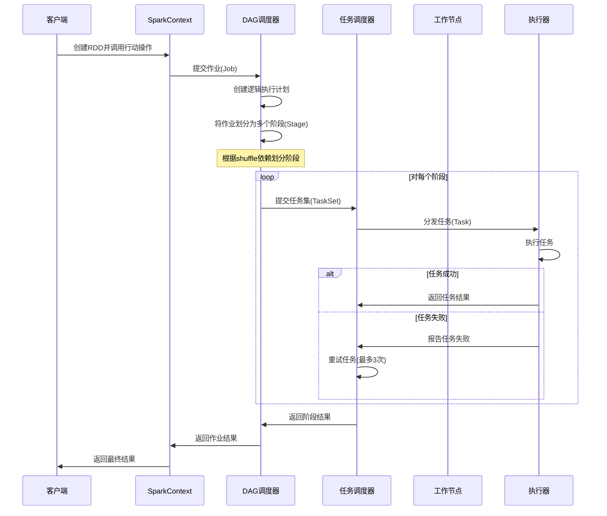
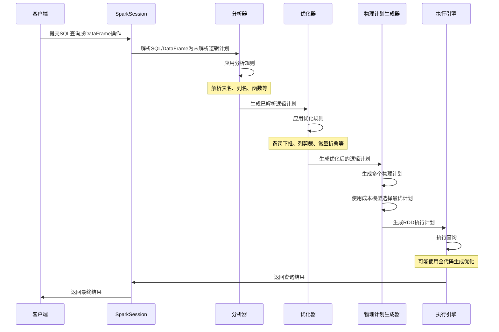
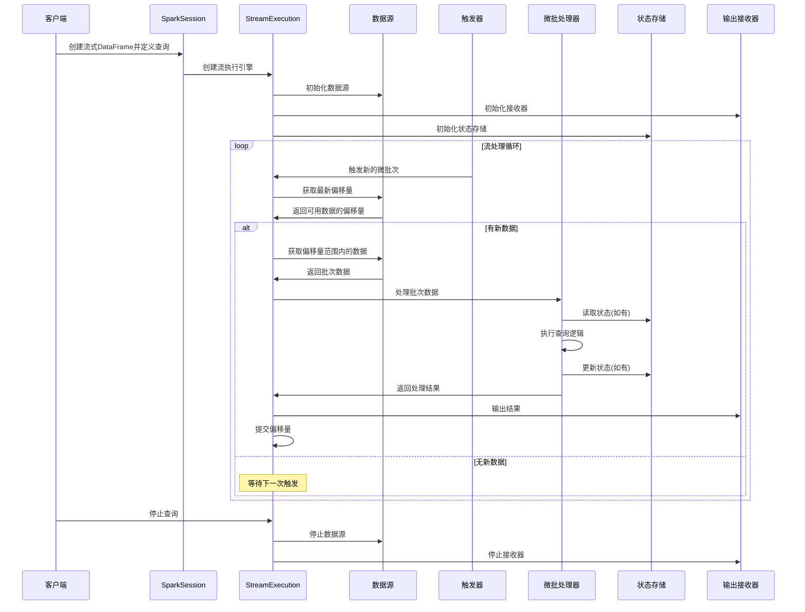
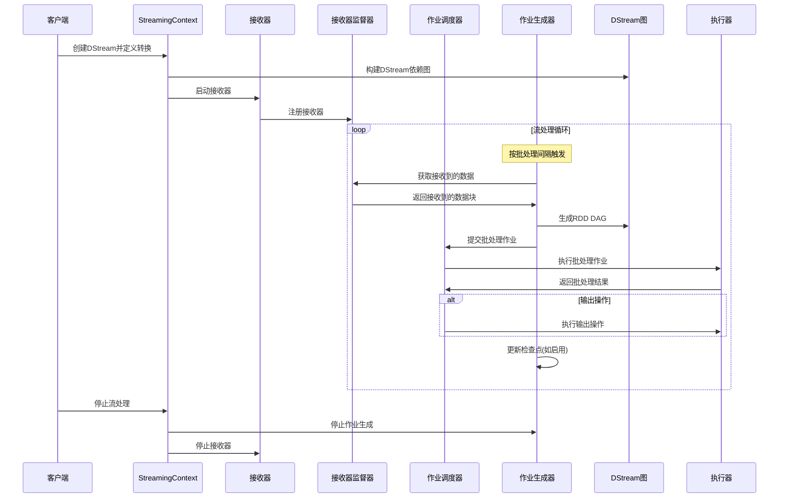
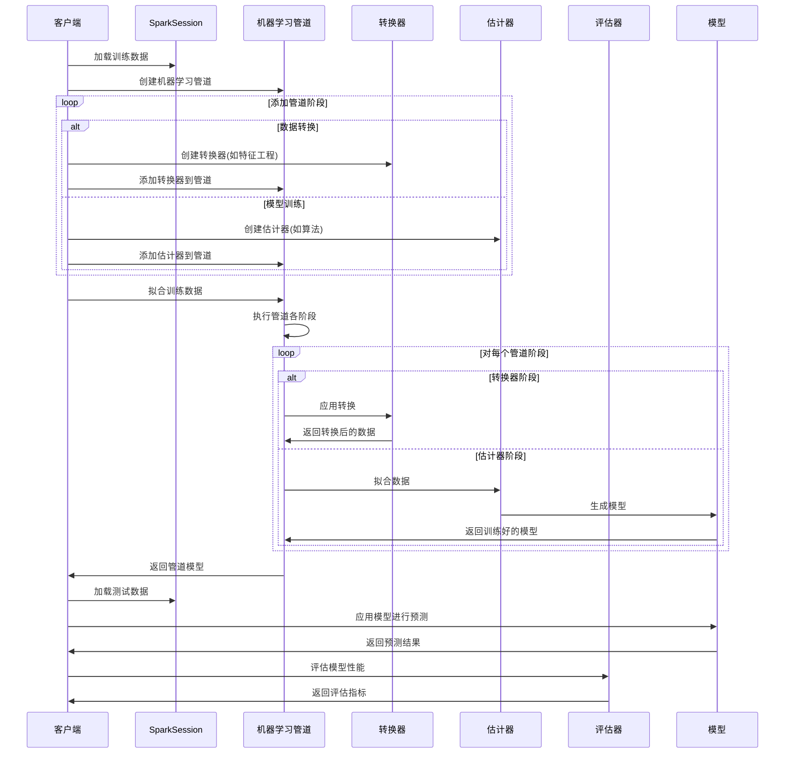
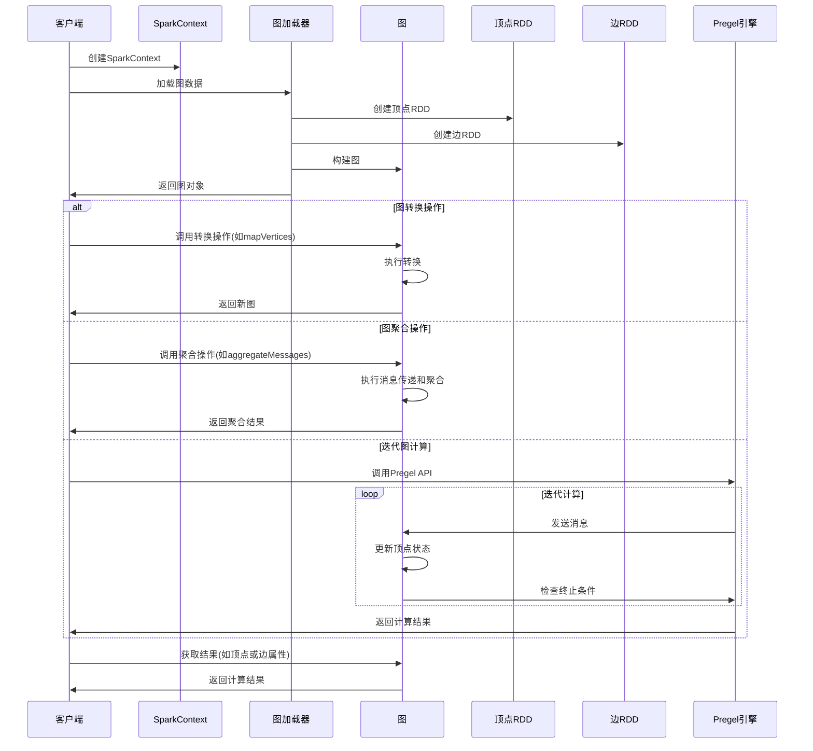

# Apache Spark 核心组件执行流程图

本文档使用Mermaid图表语法的sequenceDiagram（序列图）展示Spark各核心组件的执行流程。

## 目录

1. [Spark Core 作业执行流程](#spark-core-作业执行流程)
2. [Spark SQL 查询执行流程](#spark-sql-查询执行流程)
3. [Structured Streaming 流处理流程](#structured-streaming-流处理流程)
4. [Spark Streaming 流处理流程](#spark-streaming-流处理流程)
5. [MLlib 机器学习流程](#mllib-机器学习流程)
6. [GraphX 图计算流程](#graphx-图计算流程)

## Spark Core 作业执行流程

## Spark SQL 查询执行流程

## Structured Streaming 流处理流程

## Spark Streaming 流处理流程

## MLlib 机器学习流程

## GraphX 图计算流程

