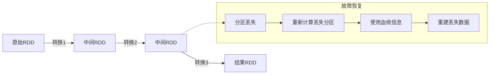
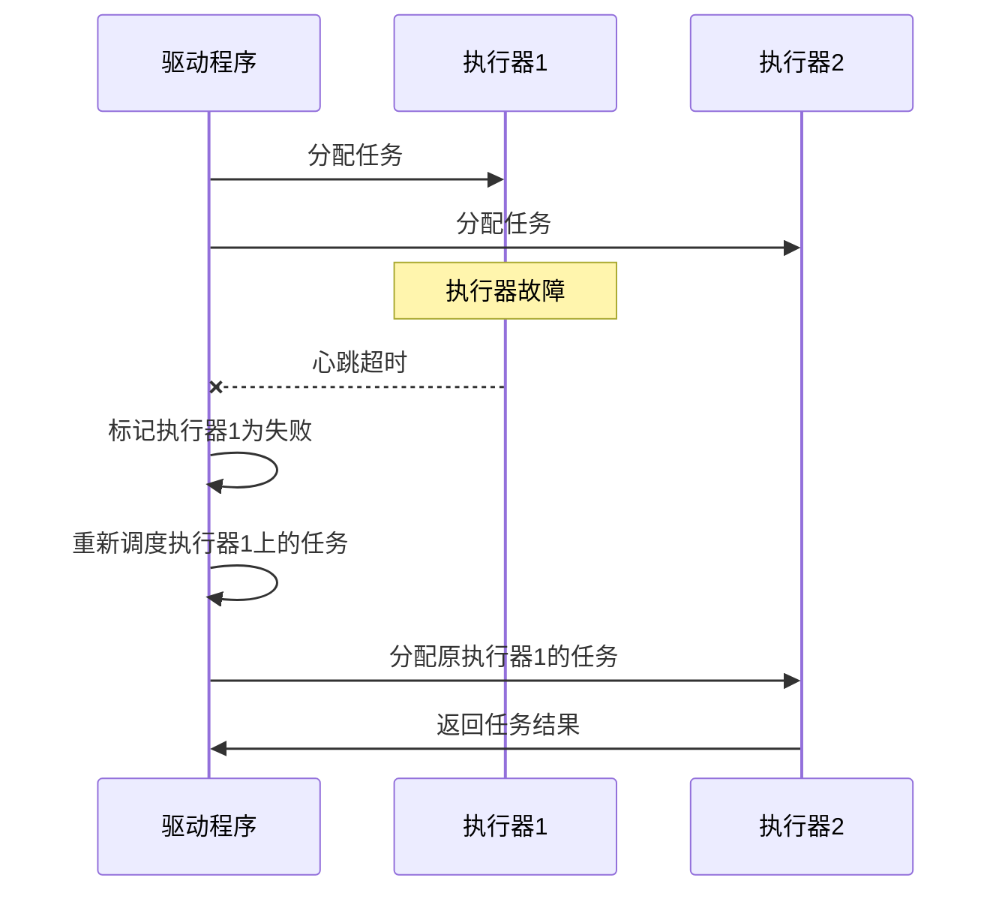
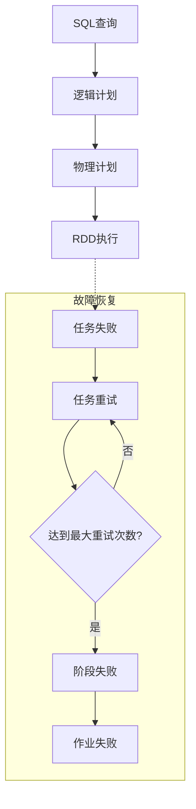
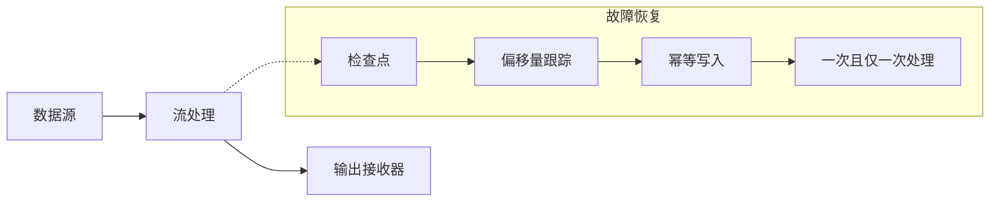
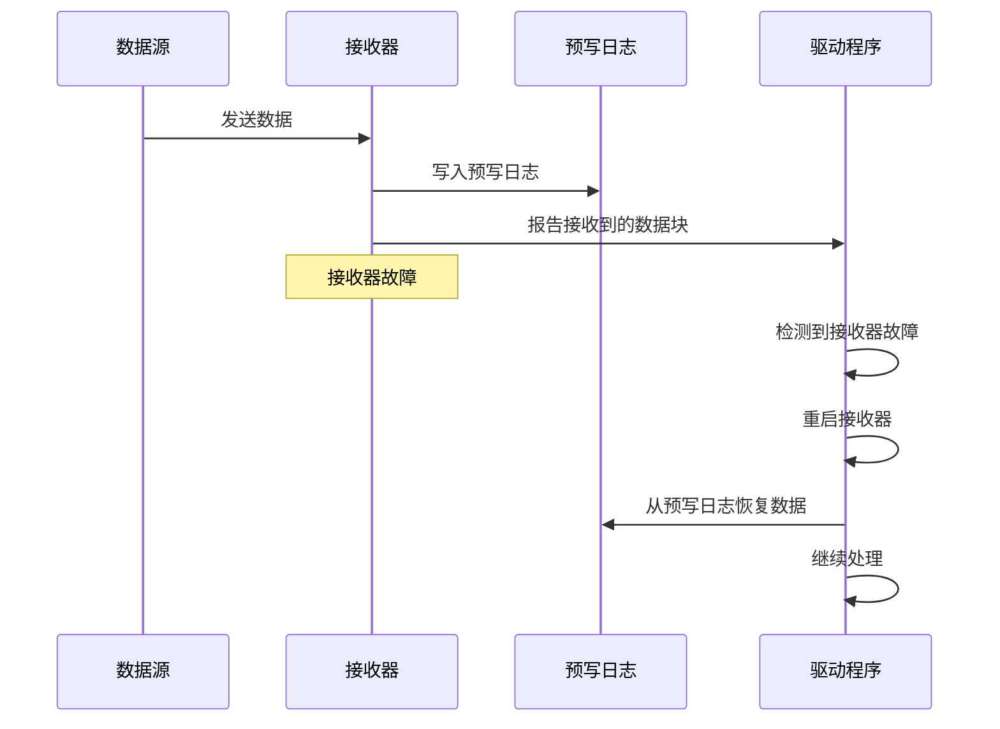
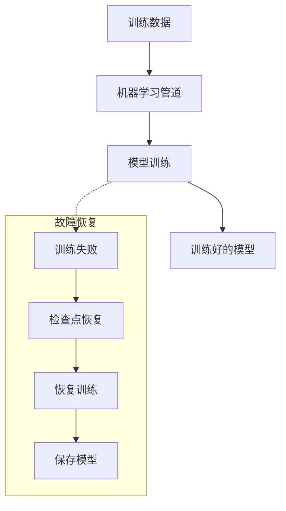
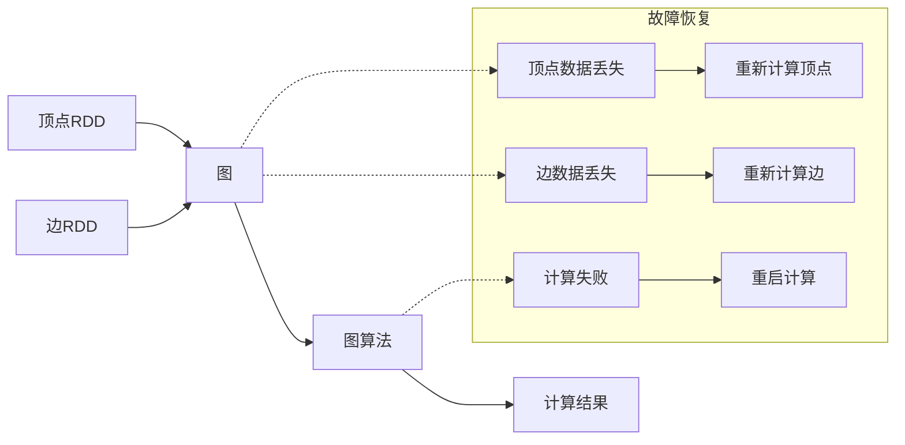

# Apache Spark 核心组件故障恢复机制

Spark作为一个分布式计算框架，必须能够处理各种故障情况，包括节点故障、网络分区和进程崩溃等。本文档详细说明了Spark各核心组件的故障恢复机制。

## 目录

1. [Spark Core 故障恢复](#spark-core-故障恢复)
2. [Spark SQL 故障恢复](#spark-sql-故障恢复)
3. [Structured Streaming 故障恢复](#structured-streaming-故障恢复)
4. [Spark Streaming 故障恢复](#spark-streaming-故障恢复)
5. [MLlib 故障恢复](#mllib-故障恢复)
6. [GraphX 故障恢复](#graphx-故障恢复)

## Spark Core 故障恢复

### RDD 血统（Lineage）恢复

RDD（弹性分布式数据集）是Spark的核心抽象，其故障恢复主要依赖于血统（Lineage）机制。

**恢复机制**：

1. **血统记录**：Spark记录所有RDD的转换操作，形成一个有向无环图（DAG）
2. **延迟计算**：RDD转换操作不会立即执行，而是记录转换关系
3. **分区重计算**：当分区数据丢失时，Spark会根据血统信息重新计算丢失的分区
4. **窄依赖优化**：对于窄依赖（一对一或多对一），只需重新计算丢失分区的父分区
5. **宽依赖处理**：对于宽依赖（一对多），可能需要重新计算整个父RDD

### Executor 故障恢复

**恢复机制**：

1. **心跳检测**：Driver通过心跳机制检测Executor故障
2. **任务重调度**：失败Executor上的任务会被重新调度到其他健康的Executor上
3. **推测执行**：对于运行缓慢的任务，Spark可以启动备份任务（推测执行），谁先完成用谁的结果
4. **资源动态分配**：根据工作负载动态请求和释放Executor

### Driver 故障恢复

Driver是Spark应用程序的控制中心，其故障恢复相对复杂。

**恢复机制**：

1. **Standalone模式**：默认不支持Driver故障恢复
2. **高可用模式**：在YARN或Kubernetes等集群管理器中，可以配置Driver自动重启
3. **检查点**：通过设置检查点目录，保存RDD数据和元数据到可靠存储
4. **外部存储**：将关键结果保存到HDFS等外部存储系统
5. **应用程序状态恢复**：重启后的Driver可以从检查点恢复应用程序状态

## Spark SQL 故障恢复

Spark SQL构建在Spark Core之上，继承了其基本的故障恢复机制，同时增加了一些特定功能。

### 查询执行故障恢复

**恢复机制**：

1. **任务级重试**：单个任务失败时自动重试（默认最多4次）
2. **阶段级重试**：如果任务重试失败，整个阶段可能需要重新执行
3. **查询优化**：Catalyst优化器可以生成更高效的执行计划，减少故障风险
4. **持久化中间结果**：对于复杂查询，可以持久化中间结果，减少重计算开销
5. **广播变量**：对于频繁使用的小表，使用广播变量减少数据传输和故障风险

### 缓存表故障恢复

**恢复机制**：

1. **内存缓存**：缓存表存储在内存中，加速查询
2. **缓存失效**：当节点故障导致缓存数据丢失时，会自动从源数据重新计算
3. **缓存持久化**：可以将缓存表持久化到磁盘，提高故障恢复能力
4. **缓存替换策略**：当内存不足时，使用LRU（最近最少使用）策略替换缓存

## Structured Streaming 故障恢复

Structured Streaming是Spark的流处理引擎，需要更强的故障恢复能力来确保数据处理的准确性和完整性。

### 端到端一次性语义（End-to-End Exactly-Once Semantics）

**恢复机制**：

1. **检查点**：定期将流处理状态保存到可靠存储（如HDFS）
2. **偏移量跟踪**：记录每个数据源的处理进度（偏移量）
3. **状态存储**：对于有状态操作，将状态信息持久化到状态存储
4. **幂等写入**：确保即使在重复处理的情况下，输出结果也是一致的
5. **原子提交**：将偏移量和输出结果作为一个原子操作提交

### 微批处理恢复

**恢复机制**：

1. **批次原子性**：每个微批次要么完全处理，要么完全失败
2. **批次重放**：失败的微批次可以从检查点重新处理
3. **偏移量提交**：只有在微批次成功处理后才提交偏移量
4. **状态恢复**：从检查点恢复状态信息，确保有状态操作的正确性
5. **水印机制**：使用水印处理迟到数据，提高系统容错性

## Spark Streaming 故障恢复

Spark Streaming是基于微批处理的流处理引擎，其故障恢复机制与Structured Streaming有所不同。

### 接收器（Receiver）故障恢复

**恢复机制**：

1. **预写日志（WAL）**：接收到的数据可以写入预写日志，确保数据不丢失
2. **接收器重启**：当接收器故障时，Driver会自动重启接收器
3. **数据块复制**：可以配置数据块在多个节点上复制，提高可用性
4. **接收器监控**：Driver持续监控接收器状态，及时发现故障

### DStream 处理故障恢复

**恢复机制**：

1. **检查点**：定期将DStream的元数据和RDD保存到可靠存储
2. **批次间隔调整**：可以调整批次间隔，平衡延迟和恢复开销
3. **状态恢复**：对于有状态操作（如updateStateByKey），从检查点恢复状态
4. **输出操作语义**：提供至少一次处理语义，应用程序需要处理重复数据

## MLlib 故障恢复

MLlib是Spark的机器学习库，其故障恢复主要关注模型训练和预测过程的可靠性。

### 模型训练故障恢复

**恢复机制**：

1. **迭代检查点**：对于迭代算法（如梯度下降），可以定期保存中间状态
2. **模型持久化**：将训练好的模型保存到可靠存储
3. **训练恢复**：支持从检查点恢复训练过程
4. **参数服务器容错**：在分布式训练中，参数服务器可以容忍部分节点故障
5. **数据分区容错**：训练数据分布在多个节点上，单节点故障不影响整体训练

### 模型服务故障恢复

**恢复机制**：

1. **模型复制**：将模型部署在多个节点上，提高可用性
2. **模型版本控制**：管理模型版本，支持回滚到稳定版本
3. **预测结果缓存**：缓存常见查询的预测结果，减少计算开销
4. **模型热加载**：支持不停机更新模型

## GraphX 故障恢复

GraphX是Spark的图计算引擎，其故障恢复机制主要依赖于RDD的恢复能力。

### 图处理故障恢复

**恢复机制**：

1. **顶点和边RDD恢复**：利用RDD的血统机制恢复丢失的顶点和边数据
2. **图分区容错**：图数据分布在多个分区上，单分区故障不影响整体计算
3. **迭代算法检查点**：对于Pregel等迭代算法，可以定期设置检查点
4. **增量计算**：支持增量图计算，减少重计算开销
5. **图缓存**：可以缓存图的中间状态，加速恢复过程

### Pregel 引擎故障恢复

**恢复机制**：

1. **超步检查点**：在Pregel计算的特定超步设置检查点
2. **消息可靠传递**：确保顶点间消息的可靠传递
3. **顶点状态恢复**：从检查点恢复顶点状态
4. **计算恢复**：支持从最近的检查点恢复计算
5. **失败顶点处理**：处理计算过程中失败的顶点
