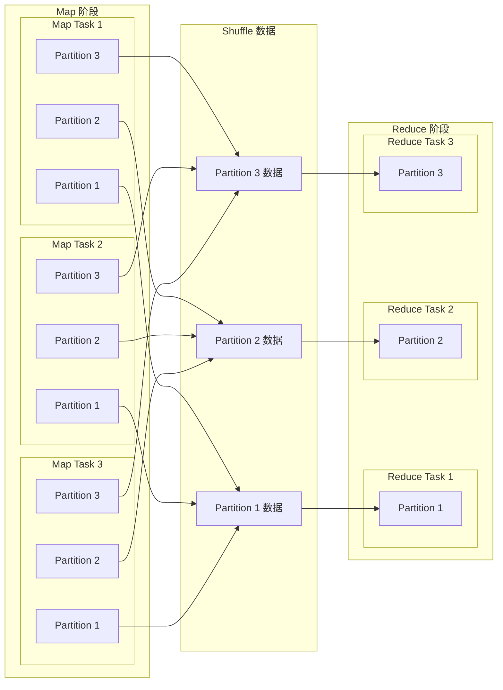

# Spark Shuffle 机制源码详解

Shuffle 是 Spark 中最关键的数据交换机制，它发生在 reduceByKey、groupByKey、join 等操作中，涉及到数据的重新分区和网络传输。本章将深入分析 Spark Shuffle 机制的实现原理和源码细节。

## 1. Shuffle 概述

Shuffle 是分布式计算中的关键环节，它将数据从 map 任务所在的节点传输到 reduce 任务所在的节点，实现数据的重新分区。Spark 的 Shuffle 经历了多次演进，从最初的 Hash-based Shuffle 到现在的 Sort-based Shuffle。

### 1.1 Shuffle 的基本流程

Shuffle 的基本流程包括两个阶段：

1. **Shuffle Write**：map 任务将输出数据按照分区写入磁盘
2. **Shuffle Read**：reduce 任务从远程节点读取属于自己的数据



### 1.2 Shuffle 的演进历史

Spark Shuffle 机制经历了多次演进：

1. **Hash-based Shuffle**：Spark 0.8 及之前版本使用的 Shuffle 实现，每个 map 任务为每个 reduce 任务创建一个文件，导致大量小文件
2. **Sort-based Shuffle**：Spark 0.8.1 引入，每个 map 任务只生成一个文件，减少了文件数量
3. **Consolidated Sort-based Shuffle**：Spark 1.1 引入，多个 map 任务可以共用同一个输出文件，进一步减少文件数量
4. **Tungsten Sort-based Shuffle**：Spark 1.4 引入，利用堆外内存和二进制数据格式优化 Shuffle 性能
5. **Push-based Shuffle**：Spark 3.2 引入的实验性功能，通过主动推送数据减少 Shuffle 延迟

## 2. ShuffleManager 接口

ShuffleManager 是 Spark Shuffle 机制的核心接口，定义在 `org.apache.spark.shuffle.ShuffleManager` 中：

```scala
/**
 * Shuffle 系统的插件接口。在 SparkEnv 中注册，driver 和 executors 都会使用。
 */
private[spark] trait ShuffleManager {

  /**
   * 为 shuffle 操作注册一个 shuffle，返回一个 ShuffleHandle 用于后续操作
   */
  def registerShuffle[K, V, C](
      shuffleId: Int,
      numMaps: Int,
      dependency: ShuffleDependency[K, V, C]): ShuffleHandle

  /**
   * 获取一个 writer，用于写入给定 map 任务的 shuffle 数据
   */
  def getWriter[K, V](
      handle: ShuffleHandle,
      mapId: Int,
      context: TaskContext): ShuffleWriter[K, V]

  /**
   * 获取一个 reader，用于读取给定 reduce 任务的 shuffle 数据
   */
  def getReader[K, C](
      handle: ShuffleHandle,
      startPartition: Int,
      endPartition: Int,
      context: TaskContext): ShuffleReader[K, C]

  /**
   * 从内部状态中移除 shuffle 数据
   */
  def unregisterShuffle(shuffleId: Int): Boolean

  /**
   * 返回 shuffle 数据的块管理器
   */
  def shuffleBlockResolver: ShuffleBlockResolver

  /**
   * 停止 ShuffleManager
   */
  def stop(): Unit
}
```

## 3. SortShuffleManager 实现

SortShuffleManager 是 Spark 当前默认的 Shuffle 实现，它基于排序的方式组织 Shuffle 数据。

### 3.1 SortShuffleManager 的三种 Shuffle 实现

SortShuffleManager 支持三种不同的 Shuffle 实现，分别是：

1. **普通 SortShuffleWriter**：最通用的实现，支持所有场景，但性能相对较低
2. **UnsafeShuffleWriter**：基于堆外内存的优化实现，性能更高，但有一定限制
3. **BypassMergeSortShuffleWriter**：针对小分区数量的特殊优化实现

#### 3.1.1 三种 Shuffle 实现的选择条件

SortShuffleManager 在 `registerShuffle` 方法中根据不同条件选择不同的 Shuffle 实现：

```scala
override def registerShuffle[K, V, C](
    shuffleId: Int,
    dependency: ShuffleDependency[K, V, C]): ShuffleHandle = {
  if (SortShuffleWriter.shouldBypassMergeSort(conf, dependency)) {
    // 如果分区数量小于阈值且不需要 map 端聚合，使用 BypassMergeSortShuffleWriter
    new BypassMergeSortShuffleHandle[K, V](
      shuffleId, dependency.asInstanceOf[ShuffleDependency[K, V, V]])
  } else if (SortShuffleManager.canUseSerializedShuffle(dependency)) {
    // 如果满足序列化 Shuffle 的条件，使用 UnsafeShuffleWriter
    new SerializedShuffleHandle[K, V](
      shuffleId, dependency.asInstanceOf[ShuffleDependency[K, V, V]])
  } else {
    // 否则，使用普通的 SortShuffleWriter
    new BaseShuffleHandle(shuffleId, dependency)
  }
}
```

选择 BypassMergeSortShuffleWriter 的条件：

```scala
def shouldBypassMergeSort(conf: SparkConf, dep: ShuffleDependency[_, _, _]): Boolean = {
  // 不能使用 map 端聚合
  if (dep.mapSideCombine) {
    false
  } else {
    // 分区数量小于阈值（默认为 200）
    val bypassMergeThreshold: Int = conf.get(config.SHUFFLE_SORT_BYPASS_MERGE_THRESHOLD)
    dep.partitioner.numPartitions <= bypassMergeThreshold
  }
}
```

选择 UnsafeShuffleWriter 的条件：

```scala
def canUseSerializedShuffle(dependency: ShuffleDependency[_, _, _]): Boolean = {
  val shufId = dependency.shuffleId
  val numPartitions = dependency.partitioner.numPartitions
  // 序列化器必须支持对象重定位
  if (!dependency.serializer.supportsRelocationOfSerializedObjects) {
    false
  } else if (dependency.mapSideCombine) {
    // 不能使用 map 端聚合
    false
  } else if (numPartitions > MAX_SHUFFLE_OUTPUT_PARTITIONS_FOR_SERIALIZED_MODE) {
    // 分区数量不能超过 16777216
    false
  } else {
    true
  }
}
```

#### 3.1.2 三种 Shuffle 实现的区别

| 特性 | 普通 SortShuffleWriter | UnsafeShuffleWriter | BypassMergeSortShuffleWriter |
|------|------------------------|---------------------|------------------------------|
| **适用场景** | 所有场景 | 不需要 map 端聚合，分区数 ≤ 16777216，序列化器支持对象重定位 | 不需要 map 端聚合，分区数较少（≤ 200） |
| **内存管理** | 使用 JVM 堆内存 | 使用堆外内存 | 使用 JVM 堆内存 |
| **排序方式** | 对记录进行完整排序 | 只对序列化后的二进制数据排序 | 不排序，直接写入对应分区文件 |
| **溢出处理** | 使用 ExternalSorter 进行溢出和合并 | 使用 ShuffleExternalSorter 进行溢出和合并 | 无溢出处理，直接写入磁盘 |
| **文件数量** | 每个 map 任务生成一个数据文件和一个索引文件 | 每个 map 任务生成一个数据文件和一个索引文件 | 先为每个分区生成一个临时文件，最后合并为一个数据文件和一个索引文件 |
| **性能特点** | 通用但开销较大 | 性能最好，内存效率高 | 适合小分区场景，避免排序开销 |
| **GC 压力** | 较大 | 较小 | 中等 |

#### 3.1.3 普通 SortShuffleWriter 的工作原理

普通 SortShuffleWriter 使用 ExternalSorter 对记录进行排序和溢出处理：

1. 根据是否需要 map 端聚合创建不同的 ExternalSorter
2. 将所有记录插入 ExternalSorter
3. ExternalSorter 内部使用 PartitionedAppendOnlyMap 或 PartitionedPairBuffer 存储记录
4. 当内存不足时，将数据溢出到磁盘
5. 最后将所有数据写入单个输出文件，并生成索引文件

```scala
override def write(records: Iterator[Product2[K, V]]): Unit = {
  sorter = if (dep.mapSideCombine) {
    // 如果需要 map 端聚合，创建带聚合器的 ExternalSorter
    new ExternalSorter[K, V, C](
      context, dep.aggregator, Some(dep.partitioner), dep.keyOrdering, dep.serializer)
  } else {
    // 否则创建不带聚合器的 ExternalSorter
    new ExternalSorter[K, V, V](
      context, aggregator = None, Some(dep.partitioner), ordering = None, dep.serializer)
  }
  // 插入所有记录
  sorter.insertAll(records)

  // 创建输出文件并写入数据
  val mapOutputWriter = shuffleExecutorComponents.createMapOutputWriter(
    dep.shuffleId, mapId, dep.partitioner.numPartitions)
  sorter.writePartitionedMapOutput(dep.shuffleId, mapId, mapOutputWriter, writeMetrics)
  partitionLengths = mapOutputWriter.commitAllPartitions(sorter.getChecksums).getPartitionLengths
  mapStatus = MapStatus(blockManager.shuffleServerId, partitionLengths, mapId)
}
```

#### 3.1.4 UnsafeShuffleWriter 的工作原理

UnsafeShuffleWriter 使用堆外内存和二进制数据格式优化性能：

1. 创建 ShuffleExternalSorter 用于排序和溢出处理
2. 对每条记录进行序列化，然后插入 ShuffleExternalSorter
3. ShuffleExternalSorter 内部使用 ShuffleInMemorySorter 存储指向序列化数据的指针
4. 当内存不足时，将数据溢出到磁盘
5. 最后合并所有溢出文件，生成单个输出文件和索引文件

##### 为什么 UnsafeShuffleWriter 需要序列化器支持对象重定位

UnsafeShuffleWriter 要求序列化器支持对象重定位（relocation of serialized objects）是其核心优化机制的关键前提：

1. **对象重定位的含义**：
   - 序列化后的二进制数据可以被移动到内存中的不同位置，或者被分割成多个部分，而不影响其反序列化的正确性
   - 序列化数据不依赖于其在内存中的绝对位置

2. **UnsafeShuffleWriter 的优化机制**：
   - 不对 Java 对象本身进行排序，而是对序列化后的二进制数据进行排序
   - 不复制整个序列化数据，只存储指向这些数据的指针
   - 排序时只交换指针，而不移动实际的数据

3. **为什么需要支持对象重定位**：
   - **排序后数据的重组**：排序完成后，序列化数据的顺序已经改变，但实际的二进制数据仍然分散在内存的各个位置
   - **溢出文件的合并**：来自不同溢出文件的序列化数据需要被重新组合
   - **内存布局优化**：使用堆外内存和紧凑的二进制格式要求序列化数据可以在不同的内存区域之间移动

4. **哪些序列化器支持对象重定位**：
   - **KryoSerializer**：Spark 的默认序列化器，支持对象重定位
   - **JavaSerializer**：基于 Java 的序列化器，不支持对象重定位
   - **自定义 SQL 序列化器**：Spark SQL 使用的序列化器，支持对象重定位

5. **实际影响**：
   - 如果使用不支持对象重定位的序列化器，Spark 会自动降级使用普通的 SortShuffleWriter
   - 对于大多数 Spark 应用程序，默认的 KryoSerializer 已经满足这一要求

```java
@Override
public void write(scala.collection.Iterator<Product2<K, V>> records) throws IOException {
  // 创建 ShuffleExternalSorter
  sorter = new ShuffleExternalSorter(
    memoryManager,
    blockManager,
    taskContext,
    initialSortBufferSize,
    partitioner.numPartitions(),
    sparkConf,
    writeMetrics);

  // 处理每条记录
  while (records.hasNext()) {
    final Product2<K, V> record = records.next();
    final K key = record._1();
    final int partitionId = partitioner.getPartition(key);

    // 序列化记录
    serBuffer.reset();
    serOutputStream.writeKey(key, OBJECT_CLASS_TAG);
    serOutputStream.writeValue(record._2(), OBJECT_CLASS_TAG);
    serOutputStream.flush();

    // 插入序列化后的记录
    sorter.insertRecord(
      serBuffer.getBuf(), Platform.BYTE_ARRAY_OFFSET, serBuffer.size(), partitionId);
  }

  // 关闭并写入输出
  closeAndWriteOutput();
}
```

#### 3.1.5 BypassMergeSortShuffleWriter 的工作原理

BypassMergeSortShuffleWriter 为每个分区创建单独的文件，然后合并这些文件：

1. 为每个分区创建一个 DiskBlockObjectWriter
2. 根据分区 ID 将记录写入对应的文件
3. 提交所有分区文件
4. 将所有分区文件合并为一个数据文件，并生成索引文件
5. 删除临时分区文件

```java
@Override
public void write(Iterator<Product2<K, V>> records) throws IOException {
  // 创建 map 输出写入器
  ShuffleMapOutputWriter mapOutputWriter = shuffleExecutorComponents
      .createMapOutputWriter(shuffleId, mapId, numPartitions);

  // 创建每个分区的写入器
  partitionWriters = new DiskBlockObjectWriter[numPartitions];
  for (int i = 0; i < numPartitions; i++) {
    final Tuple2<TempShuffleBlockId, File> tempShuffleBlockIdPlusFile =
        blockManager.diskBlockManager().createTempShuffleBlock();
    final File file = tempShuffleBlockIdPlusFile._2();
    final BlockId blockId = tempShuffleBlockIdPlusFile._1();
    partitionWriters[i] = blockManager.getDiskWriter(blockId, file, serInstance, fileBufferSize, writeMetrics);
  }

  // 写入记录到对应分区
  while (records.hasNext()) {
    final Product2<K, V> record = records.next();
    final K key = record._1();
    partitionWriters[partitioner.getPartition(key)].write(key, record._2());
  }

  // 提交所有分区文件
  for (int i = 0; i < numPartitions; i++) {
    partitionWriterSegments[i] = partitionWriters[i].commitAndGet();
  }

  // 合并分区文件并生成索引
  partitionLengths = writePartitionedData(mapOutputWriter);
  mapStatus = MapStatus$.MODULE$.apply(
    blockManager.shuffleServerId(), partitionLengths, mapId);
}
```

SortShuffleManager 定义在 `org.apache.spark.shuffle.sort.SortShuffleManager` 中：

```scala
private[spark] class SortShuffleManager(conf: SparkConf) extends ShuffleManager with Logging {

  // 是否启用 Tungsten-Sort Shuffle
  private val tungsten = conf.get(config.SHUFFLE_USE_TUNGSTEN_ENABLED)

  // 是否启用 Shuffle 文件合并
  private val consolidateFiles = conf.get(config.SHUFFLE_CONSOLIDATE_FILES)

  // 是否启用 Shuffle 文件压缩
  private val shuffleCompress = conf.get(config.SHUFFLE_COMPRESS)

  // 是否启用 Shuffle 溢出压缩
  private val shuffleSpillCompress = conf.get(config.SHUFFLE_SPILL_COMPRESS)

  // 是否启用 Shuffle 文件追踪
  private val shuffleFileTracker = conf.get(config.SHUFFLE_FILE_TRACKER)

  // 是否启用 Shuffle 服务
  private val shuffleService = conf.get(config.SHUFFLE_SERVICE_ENABLED)

  // Shuffle 块解析器
  private val blockManager = SparkEnv.get.blockManager
  private val shuffleBlockResolver = new IndexShuffleBlockResolver(conf, blockManager)

  // 注册 Shuffle
  override def registerShuffle[K, V, C](
      shuffleId: Int,
      numMaps: Int,
      dependency: ShuffleDependency[K, V, C]): ShuffleHandle = {

    // 判断是否使用 BypassMergeSortShuffle
    if (SortShuffleManager.canUseBypassMergeSort(conf, dependency)) {
      new BypassMergeSortShuffleHandle[K, V](
        shuffleId, numMaps, dependency.asInstanceOf[ShuffleDependency[K, V, V]])
    } else if (SortShuffleManager.canUseSerializedShuffle(dependency)) {
      // 判断是否使用 SerializedShuffle
      new SerializedShuffleHandle[K, V](
        shuffleId, numMaps, dependency.asInstanceOf[ShuffleDependency[K, V, V]])
    } else {
      // 使用普通的 SortShuffle
      new BaseShuffleHandle(shuffleId, numMaps, dependency)
    }
  }

  // 获取 ShuffleWriter
  override def getWriter[K, V](
      handle: ShuffleHandle,
      mapId: Int,
      context: TaskContext): ShuffleWriter[K, V] = {

    handle match {
      case bypass: BypassMergeSortShuffleHandle[K, V] =>
        new BypassMergeSortShuffleWriter(
          bypass.shuffleId, bypass.numMaps, bypass.dependency, mapId, context, shuffleBlockResolver)
      case ser: SerializedShuffleHandle[K, V] =>
        new UnsafeShuffleWriter(
          ser.shuffleId, ser.numMaps, context, ser.dependency, shuffleBlockResolver)
      case base: BaseShuffleHandle[K, V, _] =>
        new SortShuffleWriter(base, mapId, context, shuffleBlockResolver)
    }
  }

  // 获取 ShuffleReader
  override def getReader[K, C](
      handle: ShuffleHandle,
      startPartition: Int,
      endPartition: Int,
      context: TaskContext): ShuffleReader[K, C] = {

    new BlockStoreShuffleReader(
      handle.asInstanceOf[BaseShuffleHandle[K, _, C]],
      startPartition, endPartition, context)
  }

  // 其他方法...
}
```

### 3.2 ShuffleHandle 类型

ShuffleHandle 是 Shuffle 操作的句柄，用于标识一个 Shuffle 操作。SortShuffleManager 支持三种类型的 ShuffleHandle：

```scala
// 基本的 ShuffleHandle
private[spark] class BaseShuffleHandle[K, V, C](
    shuffleId: Int,
    val numMaps: Int,
    val dependency: ShuffleDependency[K, V, C])
  extends ShuffleHandle(shuffleId)

// 序列化 ShuffleHandle，用于 UnsafeShuffleWriter
private[spark] class SerializedShuffleHandle[K, V](
    shuffleId: Int,
    val numMaps: Int,
    val dependency: ShuffleDependency[K, V, V])
  extends BaseShuffleHandle[K, V, V](shuffleId, numMaps, dependency)

// 绕过合并排序的 ShuffleHandle，用于 BypassMergeSortShuffleWriter
private[spark] class BypassMergeSortShuffleHandle[K, V](
    shuffleId: Int,
    val numMaps: Int,
    val dependency: ShuffleDependency[K, V, V])
  extends BaseShuffleHandle[K, V, V](shuffleId, numMaps, dependency)
```

### 3.3 ShuffleWriter 实现

ShuffleWriter 负责将 map 任务的输出写入磁盘。SortShuffleManager 支持三种类型的 ShuffleWriter：

#### 3.3.1 SortShuffleWriter

SortShuffleWriter 是最通用的 ShuffleWriter 实现，它将数据排序后写入单个文件：

```scala
private[spark] class SortShuffleWriter[K, V, C](
    shuffleHandle: BaseShuffleHandle[K, V, C],
    mapId: Int,
    context: TaskContext,
    shuffleBlockResolver: IndexShuffleBlockResolver)
  extends ShuffleWriter[K, V] with Logging {

  private val dep = shuffleHandle.dependency
  private val blockManager = SparkEnv.get.blockManager
  private val serInstance = dep.serializer.newInstance()

  // 创建外部排序器
  private val sorter = if (dep.mapSideCombine) {
    new ExternalSorter[K, V, C](
      context, dep.aggregator, Some(dep.partitioner), dep.keyOrdering, dep.serializer)
  } else {
    new ExternalSorter[K, V, V](
      context, None, Some(dep.partitioner), None, dep.serializer)
  }

  // 写入记录
  override def write(records: Iterator[Product2[K, V]]): Unit = {
    sorter.insertAll(records)

    // 获取输出文件
    val outputFile = shuffleBlockResolver.getDataFile(shuffleHandle.shuffleId, mapId)
    val blockId = ShuffleBlockId(shuffleHandle.shuffleId, mapId, IndexShuffleBlockResolver.NOOP_REDUCE_ID)
    val partitionLengths = sorter.writePartitionedFile(blockId, outputFile)

    // 写入索引文件
    shuffleBlockResolver.writeIndexFileAndCommit(
      shuffleHandle.shuffleId, mapId, partitionLengths, outputFile)
  }

  // 停止
  override def stop(success: Boolean): Option[MapStatus] = {
    try {
      if (success) {
        val blockId = ShuffleBlockId(shuffleHandle.shuffleId, mapId, IndexShuffleBlockResolver.NOOP_REDUCE_ID)
        val status = MapStatus(blockManager.shuffleServerId, sorter.getPartitionLengths)
        return Some(status)
      } else {
        return None
      }
    } finally {
      sorter.stop()
    }
  }
}
```

#### 3.3.2 UnsafeShuffleWriter

UnsafeShuffleWriter 是基于 Tungsten 内存管理的 ShuffleWriter 实现，它使用堆外内存和二进制数据格式优化性能：

```scala
private[spark] class UnsafeShuffleWriter[K, V](
    shuffleHandle: SerializedShuffleHandle[K, V],
    mapId: Int,
    context: TaskContext,
    shuffleDep: ShuffleDependency[K, V, V],
    shuffleBlockResolver: IndexShuffleBlockResolver)
  extends ShuffleWriter[K, V] with Logging {

  private val blockManager = SparkEnv.get.blockManager
  private val serInstance = shuffleDep.serializer.newInstance()
  private val writeMetrics = context.taskMetrics().shuffleWriteMetrics

  // 分区器
  private val partitioner = shuffleDep.partitioner
  private val numPartitions = partitioner.numPartitions

  // 溢出大小阈值
  private val initialSortBufferSize = SparkEnv.get.conf.get(config.SHUFFLE_SORT_INIT_BUFFER_SIZE)

  // 分区长度数组
  private var partitionLengths: Array[Long] = _

  // 写入记录
  override def write(records: Iterator[Product2[K, V]]): Unit = {
    // 创建排序器
    val sorter = new UnsafeShuffleExternalSorter(
      blockManager,
      context.taskMemoryManager(),
      SparkEnv.get.conf,
      shuffleDep.serializer,
      initialSortBufferSize,
      numPartitions,
      writeMetrics)

    // 写入记录
    while (records.hasNext) {
      val record = records.next()
      val partitionId = partitioner.getPartition(record._1)
      sorter.insertRecord(record._1, record._2, partitionId)
    }

    // 获取输出文件
    val outputFile = shuffleBlockResolver.getDataFile(shuffleHandle.shuffleId, mapId)
    val blockId = ShuffleBlockId(shuffleHandle.shuffleId, mapId, IndexShuffleBlockResolver.NOOP_REDUCE_ID)

    // 写入分区文件
    partitionLengths = sorter.writePartitionedFile(blockId, outputFile)

    // 写入索引文件
    shuffleBlockResolver.writeIndexFileAndCommit(
      shuffleHandle.shuffleId, mapId, partitionLengths, outputFile)
  }

  // 停止
  override def stop(success: Boolean): Option[MapStatus] = {
    if (success) {
      val status = MapStatus(blockManager.shuffleServerId, partitionLengths)
      Some(status)
    } else {
      None
    }
  }
}
```

#### 3.3.3 BypassMergeSortShuffleWriter

BypassMergeSortShuffleWriter 用于分区数较少且不需要聚合的场景，它为每个分区创建一个文件，然后合并这些文件：

```scala
private[spark] class BypassMergeSortShuffleWriter[K, V](
    shuffleId: Int,
    numMaps: Int,
    dependency: ShuffleDependency[K, V, V],
    mapId: Int,
    context: TaskContext,
    shuffleBlockResolver: IndexShuffleBlockResolver)
  extends ShuffleWriter[K, V] with Logging {

  private val blockManager = SparkEnv.get.blockManager
  private val serInstance = dependency.serializer.newInstance()
  private val writeMetrics = context.taskMetrics().shuffleWriteMetrics

  // 分区器
  private val partitioner = dependency.partitioner
  private val numPartitions = partitioner.numPartitions

  // 写入记录
  override def write(records: Iterator[Product2[K, V]]): Unit = {
    // 创建临时文件和输出流
    val partitionWriters = Array.fill(numPartitions)(new DiskBlockObjectWriter(
      blockManager,
      File.createTempFile("shuffle", null, blockManager.diskBlockManager.getShuffleDir),
      serInstance,
      writeMetrics))

    // 写入记录到对应分区
    while (records.hasNext) {
      val record = records.next()
      val partitionId = partitioner.getPartition(record._1)
      partitionWriters(partitionId).write(record._1, record._2)
    }

    // 关闭所有输出流
    val partitionLengths = new Array[Long](numPartitions)
    for (i <- 0 until numPartitions) {
      partitionWriters(i).close()
      partitionLengths(i) = partitionWriters(i).fileSegment().length
    }

    // 合并分区文件
    val outputFile = shuffleBlockResolver.getDataFile(shuffleId, mapId)
    val partitionFiles = partitionWriters.map(_.fileSegment().file)
    File.createTempFile("shuffle", null, blockManager.diskBlockManager.getShuffleDir)

    // 写入索引文件
    shuffleBlockResolver.writeIndexFileAndCommit(shuffleId, mapId, partitionLengths, outputFile)

    // 删除临时文件
    for (file <- partitionFiles) {
      if (file.exists() && !file.delete()) {
        logWarning(s"Error deleting file ${file.getPath()}")
      }
    }
  }

  // 停止
  override def stop(success: Boolean): Option[MapStatus] = {
    if (success) {
      val status = MapStatus(blockManager.shuffleServerId, Array.fill(numPartitions)(1L))
      Some(status)
    } else {
      None
    }
  }
}
```

## 4. ShuffleReader 实现

ShuffleReader 负责从远程节点读取 Shuffle 数据。SortShuffleManager 使用 BlockStoreShuffleReader 作为 ShuffleReader 的实现。

### 4.1 BlockStoreShuffleReader

BlockStoreShuffleReader 定义在 `org.apache.spark.shuffle.BlockStoreShuffleReader` 中：

```scala
private[spark] class BlockStoreShuffleReader[K, C](
    handle: BaseShuffleHandle[K, _, C],
    startPartition: Int,
    endPartition: Int,
    context: TaskContext,
    readMetrics: ShuffleReadMetrics,
    serializerManager: SerializerManager = SparkEnv.get.serializerManager,
    blockManager: BlockManager = SparkEnv.get.blockManager,
    mapOutputTracker: MapOutputTracker = SparkEnv.get.mapOutputTracker)
  extends ShuffleReader[K, C] with Logging {

  private val dep = handle.dependency

  // 读取合并的记录
  override def read(): Iterator[Product2[K, C]] = {
    // 获取 map 输出位置
    val blocksByAddress = mapOutputTracker.getMapSizesByExecutorId(
      handle.shuffleId, startPartition, endPartition)

    // 创建 Shuffle 块获取器
    val blockFetcher = new ShuffleBlockFetcherIterator(
      context,
      blockManager.shuffleClient,
      blockManager,
      blocksByAddress,
      serializerManager.wrapStream,
      // 拉取大小
      SparkEnv.get.conf.get(config.REDUCER_MAX_SIZE_IN_FLIGHT),
      // 拉取等待超时
      SparkEnv.get.conf.get(config.REDUCER_MAX_REQS_IN_FLIGHT),
      // 最大失败次数
      SparkEnv.get.conf.get(config.MAX_REMOTE_BLOCK_SIZE_FETCH_TO_MEM),
      // 检测损坏
      SparkEnv.get.conf.get(config.DETECT_CORRUPT_SHUFFLE_FILES),
      readMetrics)

    // 反序列化数据
    val serializerInstance = dep.serializer.newInstance()
    val recordIter = blockFetcher.flatMap { case (blockId, inputStream) =>
      serializerInstance.deserializeStream(inputStream).asKeyValueIterator
    }

    // 聚合数据（如果需要）
    val aggregatedIter: Iterator[Product2[K, C]] = if (dep.aggregator.isDefined) {
      if (dep.mapSideCombine) {
        // 如果已经在 map 端进行了聚合，只需要在 reduce 端再次聚合
        val aggregator = dep.aggregator.get
        aggregator.combineCombinersByKey(recordIter, context)
      } else {
        // 如果没有在 map 端进行聚合，需要在 reduce 端进行完整的聚合
        val aggregator = dep.aggregator.get
        aggregator.combineValuesByKey(recordIter, context)
      }
    } else {
      // 如果不需要聚合，直接返回记录
      recordIter.asInstanceOf[Iterator[Product2[K, C]]]
    }

    // 排序数据（如果需要）
    dep.keyOrdering match {
      case Some(ordering: Ordering[K]) =>
        // 如果指定了排序规则，对数据进行排序
        new SortShuffleIterator(aggregatedIter, ordering)
      case None =>
        // 如果没有指定排序规则，直接返回数据
        aggregatedIter
    }
  }
}
```

## 5. ExternalSorter 实现

ExternalSorter 是 SortShuffleWriter 使用的核心组件，它负责对数据进行排序和溢出处理。

### 5.1 ExternalSorter 的核心结构

ExternalSorter 定义在 `org.apache.spark.util.collection.ExternalSorter` 中：

```scala
private[spark] class ExternalSorter[K, V, C](
    context: TaskContext,
    aggregator: Option[Aggregator[K, V, C]] = None,
    partitioner: Option[Partitioner] = None,
    ordering: Option[Ordering[K]] = None,
    serializer: Serializer = SparkEnv.get.serializer)
  extends Spillable[WritablePartitionedPairCollection[K, C]](context.taskMemoryManager())
  with Logging {

  // 分区数
  private val numPartitions = partitioner.map(_.numPartitions).getOrElse(1)

  // 是否需要排序
  private val shouldPartition = numPartitions > 1

  // 是否需要排序
  private val shouldSort = ordering.isDefined

  // 内存中的数据
  private var map = new PartitionedAppendOnlyMap[K, C]

  // 内存中的缓冲区
  private var buffer = new PartitionedPairBuffer[K, C]

  // 溢出文件
  private val spilledFiles = new ArrayBuffer[SpilledFile]

  // 插入记录
  def insertAll(records: Iterator[Product2[K, V]]): Unit = {
    // 如果需要聚合
    if (aggregator.isDefined) {
      // 遍历记录
      records.foreach { case (k, v) =>
        // 获取分区ID
        val partitionId = if (shouldPartition) partitioner.get.getPartition(k) else 0

        // 插入记录到内存中的映射
        map.changeValue((partitionId, k), (exists, agg) => {
          if (exists) {
            // 如果记录已存在，进行聚合
            aggregator.get.mergeValue(agg, v)
          } else {
            // 如果记录不存在，创建新的聚合值
            aggregator.get.createCombiner(v)
          }
        })

        // 如果内存不足，进行溢出
        maybeSpillCollection(usingMap = true)
      }
    } else {
      // 如果不需要聚合
      records.foreach { case (k, v) =>
        // 获取分区ID
        val partitionId = if (shouldPartition) partitioner.get.getPartition(k) else 0

        // 插入记录到内存中的缓冲区
        buffer.insert((partitionId, k), v.asInstanceOf[C])

        // 如果内存不足，进行溢出
        maybeSpillCollection(usingMap = false)
      }
    }
  }

  // 写入分区文件
  def writePartitionedFile(blockId: BlockId, outputFile: File): Array[Long] = {
    // 获取所有分区的迭代器
    val iter = partitionedIterator

    // 创建输出流
    val out = new FileOutputStream(outputFile)
    val writeMetrics = context.taskMetrics().shuffleWriteMetrics

    // 创建分区长度数组
    val partitionLengths = new Array[Long](numPartitions)

    // 写入每个分区的数据
    for ((partitionId, iterator) <- iter) {
      // 记录分区起始位置
      val startOffset = out.getChannel.position()

      // 写入分区数据
      val writer = new OutputStreamWriter(out)
      iterator.foreach { case (k, c) =>
        writer.write(k.toString)
        writer.write(',')
        writer.write(c.toString)
        writer.write('\n')
      }
      writer.flush()

      // 计算分区长度
      partitionLengths(partitionId) = out.getChannel.position() - startOffset
    }

    // 关闭输出流
    out.close()

    // 返回分区长度
    partitionLengths
  }

  // 获取分区迭代器
  def partitionedIterator: Iterator[(Int, Iterator[Product2[K, C]])] = {
    // 如果没有溢出文件，直接返回内存中的数据
    if (spilledFiles.isEmpty) {
      // 如果使用映射
      if (aggregator.isDefined) {
        // 返回映射中的数据
        map.iterator.asInstanceOf[Iterator[(Int, Iterator[Product2[K, C]])]]
      } else {
        // 返回缓冲区中的数据
        buffer.iterator.asInstanceOf[Iterator[(Int, Iterator[Product2[K, C]])]]
      }
    } else {
      // 如果有溢出文件，需要合并
      merge().asInstanceOf[Iterator[(Int, Iterator[Product2[K, C]])]]
    }
  }

  // 溢出内存中的数据到磁盘
  private def spill(collection: WritablePartitionedPairCollection[K, C]): Unit = {
    val spillFile = spillMemoryIteratorToDisk(collection.destructiveSortedIterator(keyComparator))
    spilledFiles += spillFile
  }

  // 合并溢出文件和内存中的数据
  private def merge(): Iterator[(Int, Iterator[Product2[K, C]])] = {
    // 创建溢出文件迭代器
    val spilledIters = spilledFiles.map { spill =>
      val reader = new SpillReader(spill.file)
      reader.readPartitionedIterator()
    }

    // 创建内存中数据的迭代器
    val inMemoryIterator = if (aggregator.isDefined) {
      map.iterator
    } else {
      buffer.iterator
    }

    // 合并所有迭代器
    new SpillableIterator(
      Array(inMemoryIterator) ++ spilledIters,
      keyComparator)
  }
}
```

### 5.2 溢出机制

ExternalSorter 继承自 Spillable，它提供了内存不足时将数据溢出到磁盘的机制：

```scala
private[spark] abstract class Spillable[C](taskMemoryManager: TaskMemoryManager)
  extends MemoryConsumer(taskMemoryManager) with Logging {

  // 溢出阈值
  private val spillingEnabled = SparkEnv.get.conf.get(config.SHUFFLE_SPILL_ENABLED)

  // 内存使用量
  private var _memoryUsage: Long = 0L

  // 获取内存使用量
  def memoryUsage: Long = _memoryUsage

  // 更新内存使用量
  def updateMemoryUsage(delta: Long): Unit = {
    _memoryUsage += delta
  }

  // 可能需要溢出
  protected def maybeSpill(collection: C, size: Long): Boolean = {
    // 更新内存使用量
    updateMemoryUsage(size)

    // 如果内存不足，进行溢出
    if (needToSpill()) {
      spill(collection)
      true
    } else {
      false
    }
  }

  // 是否需要溢出
  protected def needToSpill(): Boolean = {
    // 如果禁用溢出，返回 false
    if (!spillingEnabled) {
      return false
    }

    // 如果内存使用量超过阈值，返回 true
    _memoryUsage > SparkEnv.get.conf.get(config.SHUFFLE_SPILL_MEMORY_THRESHOLD)
  }

  // 溢出数据到磁盘
  protected def spill(collection: C): Unit
}
```

## 6. IndexShuffleBlockResolver 实现

IndexShuffleBlockResolver 负责管理 Shuffle 数据文件和索引文件，它定义在 `org.apache.spark.shuffle.IndexShuffleBlockResolver` 中：

```scala
private[spark] class IndexShuffleBlockResolver(
    conf: SparkConf,
    _blockManager: BlockManager = null)
  extends ShuffleBlockResolver with Logging {

  // 块管理器
  private val blockManager = Option(_blockManager).getOrElse(SparkEnv.get.blockManager)

  // 是否压缩 Shuffle 文件
  private val compressShuffleFile = conf.get(config.SHUFFLE_COMPRESS)

  // 获取数据文件
  def getDataFile(shuffleId: Int, mapId: Int): File = {
    blockManager.diskBlockManager.getFile(ShuffleDataBlockId(shuffleId, mapId, NOOP_REDUCE_ID))
  }

  // 获取索引文件
  def getIndexFile(shuffleId: Int, mapId: Int): File = {
    blockManager.diskBlockManager.getFile(ShuffleIndexBlockId(shuffleId, mapId, NOOP_REDUCE_ID))
  }

  // 写入索引文件并提交
  def writeIndexFileAndCommit(
      shuffleId: Int,
      mapId: Int,
      lengths: Array[Long],
      dataTmp: File): Unit = {
    // 创建临时索引文件
    val indexFile = getIndexFile(shuffleId, mapId)
    val indexTmp = File.createTempFile("shuffle", ".index", indexFile.getParentFile)

    // 写入索引文件
    try {
      val out = new DataOutputStream(new BufferedOutputStream(new FileOutputStream(indexTmp)))
      try {
        // 写入每个分区的偏移量
        var offset = 0L
        out.writeLong(offset)
        for (length <- lengths) {
          offset += length
          out.writeLong(offset)
        }
      } finally {
        out.close()
      }

      // 重命名临时文件
      if (indexTmp.renameTo(indexFile)) {
        // 重命名数据文件
        val dataFile = getDataFile(shuffleId, mapId)
        if (dataTmp.renameTo(dataFile)) {
          return
        }
      }

      // 如果重命名失败，抛出异常
      throw new IOException("Failed to rename shuffle files")
    } finally {
      // 删除临时文件
      if (indexTmp.exists() && !indexTmp.delete()) {
        logWarning(s"Failed to delete temporary index file: ${indexTmp.getAbsolutePath}")
      }
    }
  }

  // 获取块数据
  override def getBlockData(blockId: ShuffleBlockId): ManagedBuffer = {
    // 获取 Shuffle ID、Map ID 和 Reduce ID
    val (shuffleId, mapId, reduceId) = (blockId.shuffleId, blockId.mapId, blockId.reduceId)

    // 获取索引文件
    val indexFile = getIndexFile(shuffleId, mapId)

    // 读取索引文件
    val in = new DataInputStream(new FileInputStream(indexFile))
    try {
      // 跳过前面的偏移量
      in.skip(reduceId * 8)

      // 读取当前分区的起始偏移量和结束偏移量
      val offset = in.readLong()
      val nextOffset = in.readLong()
      val length = nextOffset - offset

      // 返回数据块
      new FileSegmentManagedBuffer(
        blockManager.diskBlockManager,
        getDataFile(shuffleId, mapId),
        offset,
        length)
    } finally {
      in.close()
    }
  }

  // 其他方法...
}
```

## 7. ShuffleBlockFetcherIterator 实现

ShuffleBlockFetcherIterator 负责从远程节点获取 Shuffle 数据，它定义在 `org.apache.spark.shuffle.ShuffleBlockFetcherIterator` 中：

```scala
private[spark] final class ShuffleBlockFetcherIterator(
    context: TaskContext,
    shuffleClient: ShuffleClient,
    blockManager: BlockManager,
    blocksByAddress: Iterator[(BlockManagerId, Seq[(BlockId, Long)])],
    streamWrapper: (BlockId, InputStream) => InputStream,
    maxBytesInFlight: Long,
    maxReqsInFlight: Int,
    maxBlocksInFlightPerAddress: Int,
    detectCorrupt: Boolean,
    metrics: ShuffleReadMetrics)
  extends Iterator[(BlockId, InputStream)] with Logging {

  // 远程请求队列
  private val remoteRequests = new LinkedHashMap[BlockManagerId, Seq[(BlockId, Long)]]

  // 本地块队列
  private val localBlocks = new ArrayBuffer[(BlockId, Long)]

  // 结果队列
  private val results = new LinkedBlockingQueue[(BlockId, InputStream)]

  // 初始化
  initialize()

  // 初始化方法
  private def initialize(): Unit = {
    // 将块按照本地和远程分类
    blocksByAddress.foreach { case (address, blocks) =>
      if (address.executorId == blockManager.blockManagerId.executorId) {
        // 本地块
        localBlocks ++= blocks
      } else {
        // 远程块
        remoteRequests.put(address, blocks)
      }
    }

    // 获取本地块
    fetchLocalBlocks()

    // 获取远程块
    fetchRemoteBlocks()
  }

  // 获取本地块
  private def fetchLocalBlocks(): Unit = {
    // 遍历本地块
    localBlocks.foreach { case (blockId, size) =>
      // 获取块数据
      val buf = blockManager.getBlockData(blockId)

      // 添加到结果队列
      results.put((blockId, buf.createInputStream()))

      // 更新指标
      metrics.incLocalBlocksFetched(1)
      metrics.incLocalBytesRead(size)
    }
  }

  // 获取远程块
  private def fetchRemoteBlocks(): Unit = {
    // 遍历远程请求
    remoteRequests.foreach { case (address, blocks) =>
      // 创建远程请求
      val req = new FetchRequest(address, blocks)

      // 发送请求
      shuffleClient.fetchBlocks(
        address.host, address.port, address.executorId, blocks.map(_._1), (blockId, buf) => {
          // 添加到结果队列
          results.put((blockId, buf.createInputStream()))

          // 更新指标
          metrics.incRemoteBlocksFetched(1)
          metrics.incRemoteBytesRead(buf.size())
        })
    }
  }

  // 是否有下一个元素
  override def hasNext: Boolean = {
    !results.isEmpty
  }

  // 获取下一个元素
  override def next(): (BlockId, InputStream) = {
    results.take()
  }
}
```

## 8. Shuffle 性能优化

Spark Shuffle 机制经过多次优化，以提高性能和稳定性。以下是一些关键的优化技术：

### 8.1 Sort-based Shuffle

Sort-based Shuffle 是 Spark 当前默认的 Shuffle 实现，它通过排序和合并减少了文件数量，解决了 Hash-based Shuffle 的小文件问题。

### 8.2 Tungsten 优化

Tungsten 优化利用堆外内存和二进制数据格式，减少了 JVM 对象开销和 GC 压力，提高了 Shuffle 性能。

### 8.3 文件合并

文件合并通过将多个 map 任务的输出合并到同一个文件中，进一步减少了文件数量，降低了文件系统的压力。

### 8.4 压缩

Shuffle 数据压缩可以减少网络传输和磁盘 I/O，但会增加 CPU 开销。Spark 支持多种压缩算法，如 LZ4、Snappy 和 ZSTD。

### 8.5 直接内存访问

直接内存访问避免了数据在堆内存和堆外内存之间的复制，减少了内存开销和 GC 压力。

### 8.6 Push-based Shuffle

Push-based Shuffle 是 Spark 3.2 引入的实验性功能，它通过主动推送数据减少了 Shuffle 延迟，提高了流处理的性能。

## 9. 总结

Spark Shuffle 机制是 Spark 的核心组件之一，它负责在不同节点之间交换数据，支持各种复杂的数据处理操作。通过深入理解 Shuffle 的实现原理和优化技术，我们可以更好地优化 Spark 应用程序的性能。

Shuffle 机制的关键组件包括：

1. **ShuffleManager**：管理 Shuffle 操作的核心接口
2. **ShuffleWriter**：负责将 map 任务的输出写入磁盘
3. **ShuffleReader**：负责从远程节点读取 Shuffle 数据
4. **ExternalSorter**：负责对数据进行排序和溢出处理
5. **IndexShuffleBlockResolver**：管理 Shuffle 数据文件和索引文件
6. **ShuffleBlockFetcherIterator**：负责从远程节点获取 Shuffle 数据

通过这些组件的协同工作，Spark 实现了高效的数据交换和处理，支持了各种复杂的数据处理操作。
