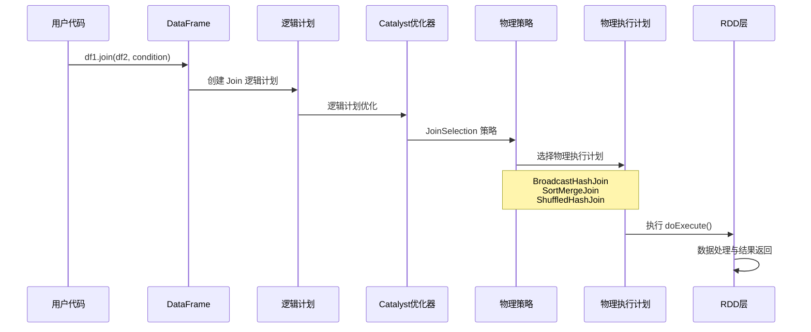
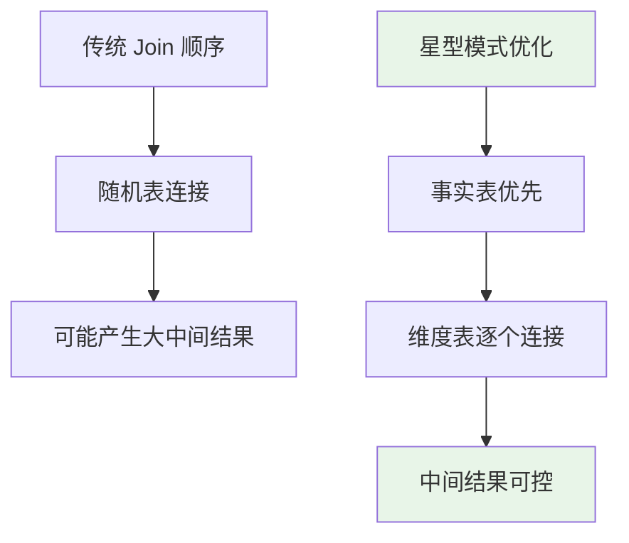
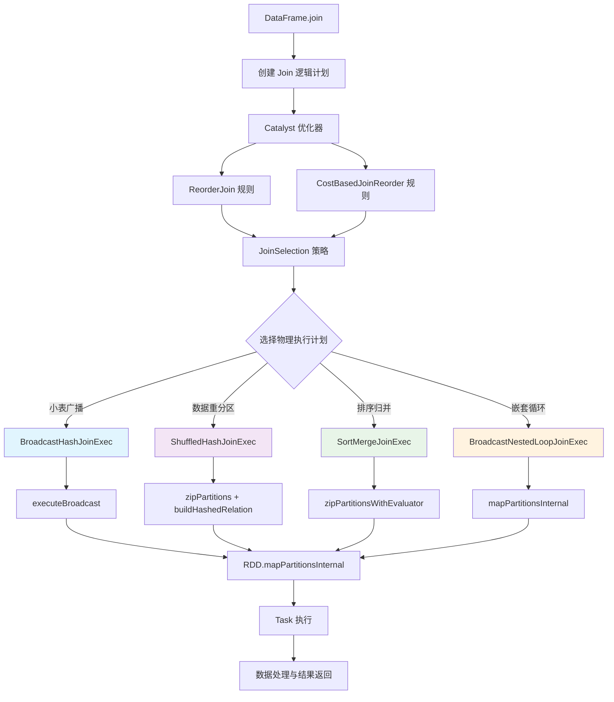
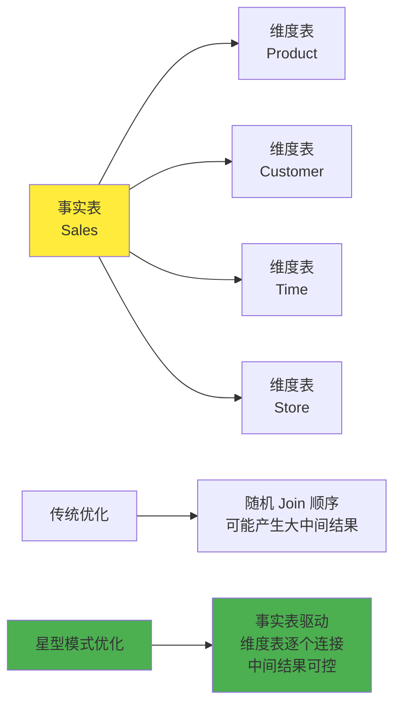

# Spark Join 机制源码分析

## 概述

Spark join 机制是分布式计算中最复杂的操作之一，涉及从 SQL/DataFrame API 到底层 RDD 的完整执行链路。本文档深入分析 Spark join 的完整流程，从用户 API 调用到最终的数据处理。

## Join 执行流程概览



## 1. DataFrame Join API 入口

### 1.1 Dataset.join 方法

DataFrame join 操作的入口点，负责创建 Join 逻辑计划节点：

<augment_code_snippet path="sql/core/src/main/scala/org/apache/spark/sql/classic/Dataset.scala" mode="EXCERPT">

````scala
// 最简单的 inner join，无条件
def join(right: sql.Dataset[_]): DataFrame = withPlan {  // withPlan: 包装逻辑计划并创建新的 DataFrame
  Join(                                                  // 创建 Join 逻辑计划节点
    left = logicalPlan,                                  // 当前 Dataset 的逻辑计划作为左侧输入
    right = right.logicalPlan,                          // 参数 Dataset 的逻辑计划作为右侧输入
    joinType = Inner,                                   // 默认使用 Inner Join 类型
    condition = None,                                   // 无 join 条件，将产生笛卡尔积
    hint = JoinHint.NONE                               // 无用户提供的性能提示
  )
}

// 带列名和 join 类型的 join
def join(right: sql.Dataset[_], usingColumns: Seq[String], joinType: String): DataFrame = {
  // 第一步：创建基础 Join 计划并进行分析
  val joined = sparkSession.sessionState.executePlan(    // 获取当前会话的执行计划器
    Join(logicalPlan,                                   // 左侧逻辑计划
         right.logicalPlan,                             // 右侧逻辑计划
         joinType = JoinType(joinType),                 // 将字符串转换为 JoinType 枚举
         None,                                          // 暂时无条件
         JoinHint.NONE))                               // 无提示
    .analyzed.asInstanceOf[Join]                        // 执行分析阶段，解析列引用等

  // 第二步：创建 UsingJoin，处理列名消歧义
  withPlan {                                            // 包装最终的逻辑计划
    Join(
      joined.left,                                      // 使用分析后的左侧计划
      joined.right,                                     // 使用分析后的右侧计划
      UsingJoin(JoinType(joinType),                    // 创建 UsingJoin 类型
                usingColumns.toIndexedSeq),            // 指定用于 join 的列名序列
      None,                                            // 条件由 UsingJoin 内部处理
      JoinHint.NONE)                                  // 无用户提示
  }
}

// 带条件表达式的 join
def join(right: sql.Dataset[_], joinExprs: Column, joinType: String): DataFrame = {
  val plan = Join(                                      // 直接创建带条件的 Join
    logicalPlan,                                       // 左侧逻辑计划
    right.logicalPlan,                                // 右侧逻辑计划
    JoinType(joinType),                               // 解析 join 类型
    Some(joinExprs.expr),                             // 将 Column 转换为 Expression
    JoinHint.NONE)                                    // 无提示
  withPlan(plan)                                       // 包装并返回
}
````

</augment_code_snippet>

**关键执行步骤：**

1. **逻辑计划创建**: 将 DataFrame join 转换为 `Join` 逻辑计划节点
2. **类型解析**: 支持 Inner、Left、Right、Full、LeftSemi、LeftAnti 等类型
3. **列名处理**: UsingJoin 自动处理重复列名的消歧义
4. **提示传递**: JoinHint 用于传递用户的性能提示

### 1.2 Join 逻辑计划节点

Join 逻辑计划包含以下核心属性：

- `left/right`: 左右子计划
- `joinType`: join 类型
- `condition`: join 条件表达式
- `hint`: join 提示信息

## 2. Catalyst 优化器处理

### 2.1 Join 重排序优化

Join 重排序是 Catalyst 优化器中最重要的优化之一，通过调整 join 顺序来减少中间结果大小：

<augment_code_snippet path="sql/catalyst/src/main/scala/org/apache/spark/sql/catalyst/optimizer/joins.scala" mode="EXCERPT">

````scala
object ReorderJoin extends Rule[LogicalPlan] with PredicateHelper {

  /**
   * Join 重排序的主要入口点
   * 目标：将多个 inner join 重新排序，优先执行选择性高的 join
   */
  def apply(plan: LogicalPlan): LogicalPlan = plan.transformWithPruning(  // 使用剪枝优化的树遍历
    _.containsPattern(INNER_LIKE_JOIN), ruleId) {                        // 只处理包含 inner join 的子树

    // 匹配包含多个 inner join 的模式
    case p @ ExtractFiltersAndInnerJoins(input, conditions)              // 提取器：分离 inner join 和过滤条件
        if input.size > 2 && conditions.nonEmpty =>                     // 条件：至少3个表且有 join 条件

      val reordered = if (conf.starSchemaDetection && !conf.cboEnabled) {  // 检查配置：星型检测开启且CBO关闭
        // 启用星型模式检测且未启用 CBO 时的处理
        val starJoinPlan = StarSchemaDetection.reorderStarJoins(input, conditions)  // 尝试星型模式重排序
        if (starJoinPlan.nonEmpty) {                                     // 如果找到星型模式
          // 找到星型模式，优先处理星型 join
          val rest = input.filterNot(starJoinPlan.contains(_))          // 获取非星型表
          createOrderedJoin(starJoinPlan ++ rest, conditions)           // 星型表优先，其他表在后
        } else {                                                         // 未找到星型模式
          // 未找到星型模式，使用默认重排序
          createOrderedJoin(input, conditions)                          // 使用通用重排序算法
        }
      } else {                                                           // 未启用星型检测或已启用CBO
        // 未启用星型检测或已启用 CBO，使用默认重排序
        createOrderedJoin(input, conditions)                            // 直接使用通用重排序算法
      }

      reordered                                                          // 返回重排序后的计划
  }

  /**
   * 创建有序的 join 计划
   * 策略：优先选择有 join 条件的表进行连接，减少笛卡尔积
   */
  @tailrec                                                               // 尾递归优化注解
  final def createOrderedJoin(
      input: Seq[(LogicalPlan, InnerLike)],                             // 输入表和对应的 join 类型
      conditions: Seq[Expression]                                       // 所有的 join 条件列表
  ): LogicalPlan = {

    assert(input.size >= 2)                                             // 断言：至少需要两个表
    if (input.size == 2) {                                             // 递归终止条件：只剩两个表
      // 只有两个表，直接创建 join
      val (left, leftJoinType) = input(0)                              // 解构第一个表和其 join 类型
      val (right, rightJoinType) = input(1)                            // 解构第二个表和其 join 类型
      val joinType = if (leftJoinType == rightJoinType) leftJoinType else Inner  // 统一 join 类型
      val joinCondition = conditions.reduceOption(And)                 // 将所有条件用 AND 连接
      Join(left, right, joinType, joinCondition, JoinHint.NONE)        // 创建最终的 Join 节点
    } else {                                                            // 递归情况：多于两个表
      // 多个表，需要选择最优的 join 顺序

      // 第一步：找到有 join 条件的表对
      val (bestLeft, bestRight, bestCondition, remainingConditions) =  // 解构最佳表对的查找结果
        findBestJoinPair(input, conditions)                            // 调用算法找到最佳的表对组合

      // 第二步：创建最优的 join 节点
      val joinNode = Join(bestLeft._1, bestRight._1,                   // 使用最佳表对创建 Join 节点
                         Inner, bestCondition, JoinHint.NONE)          // 使用 Inner join 和最佳条件

      // 第三步：递归处理剩余的表
      val remaining = input.filterNot(t => t == bestLeft || t == bestRight) :+ (joinNode, Inner)  // 移除已处理的表，添加新的 join 节点
      createOrderedJoin(remaining, remainingConditions)                // 递归处理剩余表和条件
    }
  }

  /**
   * 找到最佳的 join 表对
   * 优先级：
   * 1. 有等值条件的表对
   * 2. 有非等值条件的表对
   * 3. 统计信息较小的表对
   */
  private def findBestJoinPair(
      input: Seq[(LogicalPlan, InnerLike)],
      conditions: Seq[Expression]
  ): ((LogicalPlan, InnerLike), (LogicalPlan, InnerLike), Option[Expression], Seq[Expression]) = {

    var bestScore = -1
    var bestPair: ((LogicalPlan, InnerLike), (LogicalPlan, InnerLike)) = null
    var bestCondition: Option[Expression] = None
    var bestRemainingConditions: Seq[Expression] = conditions

    // 遍历所有可能的表对组合
    for (i <- input.indices; j <- i + 1 until input.size) {
      val left = input(i)
      val right = input(j)

      // 查找适用于这对表的 join 条件
      val (applicableConditions, remainingConditions) =
        partitionConditions(conditions, left._1, right._1)

      if (applicableConditions.nonEmpty) {
        // 有 join 条件，计算选择性得分
        val score = calculateJoinScore(left._1, right._1, applicableConditions)
        if (score > bestScore) {
          bestScore = score
          bestPair = (left, right)
          bestCondition = applicableConditions.reduceOption(And)
          bestRemainingConditions = remainingConditions
        }
      }
    }

    // 如果没有找到有条件的 join，选择统计信息最小的表对
    if (bestPair == null) {
      val sortedBySize = input.sortBy(_._1.stats.sizeInBytes)
      bestPair = (sortedBySize(0), sortedBySize(1))
      bestCondition = None
      bestRemainingConditions = conditions
    }

    (bestPair._1, bestPair._2, bestCondition, bestRemainingConditions)
  }

  /**
   * 计算 join 的选择性得分
   * 得分越高表示 join 后的结果越小，应该优先执行
   */
  private def calculateJoinScore(
      left: LogicalPlan,
      right: LogicalPlan,
      conditions: Seq[Expression]
  ): Int = {
    var score = 0

    // 等值条件得分更高
    conditions.foreach {
      case EqualTo(_, _) => score += 100
      case _ => score += 50
    }

    // 较小的表得分更高
    val leftSize = left.stats.sizeInBytes.getOrElse(Long.MaxValue)
    val rightSize = right.stats.sizeInBytes.getOrElse(Long.MaxValue)
    val sizeScore = math.max(0, 100 - (leftSize + rightSize) / 1000000).toInt

    score + sizeScore
  }
````

</augment_code_snippet>

**Join 重排序的核心思想：**

1. **减少中间结果**: 优先执行选择性高的 join，减少后续 join 的输入数据量
2. **避免笛卡尔积**: 优先选择有 join 条件的表对进行连接
3. **利用统计信息**: 根据表大小和列统计信息估算 join 成本
4. **星型模式优化**: 特殊处理数据仓库中常见的星型 schema

**重排序策略：**

- **有条件优先**: 有等值条件 > 有非等值条件 > 无条件
- **小表优先**: 统计信息小的表优先参与 join
- **选择性优先**: 选择性高的条件优先执行

### 2.2 星型模式检测与优化

星型模式是数据仓库中最常见的数据建模方式，Spark 专门针对星型模式进行了 join 优化：

<augment_code_snippet path="sql/catalyst/src/main/scala/org/apache/spark/sql/catalyst/optimizer/StarSchemaDetection.scala" mode="EXCERPT">

````scala
/**
 * 星型模式由一个或多个事实表引用多个维度表组成。通常，星型模式连接使用以下条件进行检测：
 *  1. 信息化参照完整性约束（可靠检测）
 * + 维度表包含一个主键，该主键与事实表进行连接。
 * + 事实表包含引用多个维度表的外键。
 * 2. 基于基数的启发式方法
 * + 通常，基数最高的表是事实表。
 * + 与最多数量表进行连接的表是事实表。
 *
 * 为了检测星型连接，该算法结合使用了上述两个条件。
 * 事实表基于基数启发式方法选择，维度表基于参照完整性约束选择。
 * 星型连接将由最大的事实表与维度表在其主键上进行连接组成。
 * 为了检测某列是主键，算法使用表和列的统计信息。
 *
 * 该算法目前只返回具有最大事实表的星型连接。
 * 在驱动臂上选择最大的事实表以避免大的内连接通常是一个好的启发式方法。
 * 这个限制将被取消以观察多个星型连接。
 */
object StarSchemaDetection extends PredicateHelper {

  /**
   * 星型模式检测的主要入口点
   * 返回重排序后的表序列，事实表在前，维度表在后
   */
  def reorderStarJoins(
      input: Seq[(LogicalPlan, InnerLike)],                               // 输入的表和 join 类型
      conditions: Seq[Expression]                                         // join 条件
  ): Seq[(LogicalPlan, InnerLike)] = {

    // 第一步：验证所有表是否符合星型检测条件
    val eligiblePlans = input.filter { case (plan, _) =>
      isEligibleForStarSchema(plan)                                       // 检查是否为基表访问且有统计信息
    }

    if (eligiblePlans.size < 3) {                                         // 至少需要3个表才能形成星型
      return Seq.empty                                                    // 不满足条件，返回空序列
    }

    // 第二步：找到候选事实表（基数最大的表）
    val factTableCandidate = findFactTable(eligiblePlans)                // 基于行数找到最大的表
    if (factTableCandidate.isEmpty) {
      return Seq.empty                                                    // 无法确定事实表
    }

    val factTable = factTableCandidate.get                               // 获取事实表
    val otherTables = eligiblePlans.filterNot(_ == factTable)            // 获取其他候选维度表

    // 第三步：检测维度表
    val dimensionTables = findDimensionTables(factTable, otherTables, conditions)  // 找到与事实表有主外键关系的维度表

    if (dimensionTables.size >= 2) {                                     // 至少需要2个维度表
      // 第四步：构建星型连接顺序（事实表优先）
      factTable +: dimensionTables                                       // 事实表在前，维度表在后
    } else {
      Seq.empty                                                           // 维度表不足，不是星型模式
    }
  }

  /**
   * 检查计划是否符合星型模式检测条件
   * 要求：基表访问 + 有效的统计信息
   */
  private def isEligibleForStarSchema(plan: LogicalPlan): Boolean = {
    plan match {
      case LogicalRelation(_, _, _, _) =>                                 // 基表访问
        plan.stats.rowCount.isDefined && plan.stats.rowCount.get > 0     // 有有效的行数统计
      case SubqueryAlias(_, child) =>                                     // 子查询别名
        isEligibleForStarSchema(child)                                    // 递归检查子计划
      case Project(projectList, child) if projectList.forall(_.isInstanceOf[Attribute]) =>  // 简单投影
        isEligibleForStarSchema(child)                                    // 递归检查子计划
      case Filter(condition, child) if isSimpleFilter(condition) =>      // 简单过滤
        isEligibleForStarSchema(child)                                    // 递归检查子计划
      case _ =>
        false                                                             // 其他情况不符合条件
    }
  }

  /**
   * 基于基数启发式方法找到事实表
   * 事实表通常是行数最多的表
   */
  private def findFactTable(
      plans: Seq[(LogicalPlan, InnerLike)]
  ): Option[(LogicalPlan, InnerLike)] = {

    plans.maxByOption { case (plan, _) =>
      plan.stats.rowCount.getOrElse(BigInt(0))                          // 按行数排序，选择最大的
    }
  }

  /**
   * 找到与事实表存在主外键关系的维度表
   * 通过分析 join 条件和列的唯一性来判断
   */
  private def findDimensionTables(
      factTable: (LogicalPlan, InnerLike),                              // 事实表
      candidates: Seq[(LogicalPlan, InnerLike)],                       // 候选维度表
      conditions: Seq[Expression]                                       // join 条件
  ): Seq[(LogicalPlan, InnerLike)] = {

    val dimensionTables = candidates.filter { case (dimTable, _) =>
      // 检查是否存在事实表到维度表的外键关系
      hasReferentialIntegrity(factTable._1, dimTable, conditions)        // 检查参照完整性
    }

    dimensionTables
  }

  /**
   * 检查两个表之间是否存在参照完整性关系
   * 通过分析 join 条件中的等值条件和列的唯一性
   */
  private def hasReferentialIntegrity(
      factTable: LogicalPlan,                                           // 事实表
      dimTable: LogicalPlan,                                            // 维度表
      conditions: Seq[Expression]                                       // join 条件
  ): Boolean = {

    // 找到连接这两个表的等值条件
    val joinConditions = conditions.filter { condition =>
      val references = condition.references
      val factRefs = references.intersect(factTable.outputSet)          // 事实表相关的列
      val dimRefs = references.intersect(dimTable.outputSet)            // 维度表相关的列
      factRefs.nonEmpty && dimRefs.nonEmpty                             // 条件涉及两个表
    }

    // 检查是否存在等值条件，且维度表一侧的列是唯一的
    joinConditions.exists {
      case EqualTo(left, right) =>                                      // 等值条件
        val (factCol, dimCol) = if (left.references.subsetOf(factTable.outputSet)) {
          (left, right)                                                 // 左侧是事实表列，右侧是维度表列
        } else {
          (right, left)                                                 // 右侧是事实表列，左侧是维度表列
        }

        // 检查维度表列是否为主键（唯一且非空）
        isPrimaryKey(dimCol, dimTable)                                  // 检查维度表列的唯一性

      case _ => false                                                   // 非等值条件
    }
  }

  /**
   * 检查列是否为主键
   * 通过比较不同值数量与总行数来判断唯一性
   */
  private def isPrimaryKey(column: Expression, table: LogicalPlan): Boolean = {
    column match {
      case attr: Attribute =>
        val tableStats = table.stats                                    // 获取表统计信息
        val columnStats = tableStats.attributeStats.get(attr)           // 获取列统计信息

        if (tableStats.rowCount.isDefined && columnStats.isDefined) {
          val rowCount = tableStats.rowCount.get                        // 总行数
          val distinctCount = columnStats.get.distinctCount.getOrElse(BigInt(0))  // 不同值数量
          val nullCount = columnStats.get.nullCount.getOrElse(BigInt(0))  // 空值数量

          // 判断条件：
          // 1. 无空值或空值很少
          // 2. 不同值数量接近总行数（考虑统计误差）
          val hasMinimalNulls = nullCount == 0 || nullCount.toDouble / rowCount.toDouble < 0.01
          val isUnique = math.abs(distinctCount.toDouble - rowCount.toDouble) / rowCount.toDouble < 0.1

          hasMinimalNulls && isUnique                                    // 满足主键条件
        } else {
          false                                                          // 缺少统计信息
        }
      case _ => false                                                    // 非简单列引用
    }
  }

  /**
   * 检查过滤条件是否为简单条件
   * 简单条件不会显著改变数据分布
   */
  private def isSimpleFilter(condition: Expression): Boolean = {
    condition match {
      case _: EqualTo | _: LessThan | _: LessThanOrEqual |
           _: GreaterThan | _: GreaterThanOrEqual => true               // 简单比较条件
      case And(left, right) =>
        isSimpleFilter(left) && isSimpleFilter(right)                  // 简单条件的 AND 组合
      case _ => false                                                   // 复杂条件
    }
  }
}
````

</augment_code_snippet>

**星型模式检测算法要点：**

1. **事实表识别**: 基于基数启发式，选择行数最多的表作为事实表
2. **维度表检测**: 通过参照完整性约束，找到与事实表有主外键关系的表
3. **主键判断**: 使用统计信息判断列的唯一性（不同值数量 ≈ 总行数）
4. **连接优化**: 事实表优先连接，减少中间结果大小

**星型模式优化效果：**



**配置参数：**

- `spark.sql.optimizer.starSchemaDetection`: 启用星型模式检测（默认 false）
- `spark.sql.cbo.enabled`: 启用 CBO 时会禁用星型检测
- 统计信息精度影响检测效果

### 2.3 基于成本的 Join 重排序

基于成本的优化器（CBO）使用统计信息进行更精确的 join 重排序：

<augment_code_snippet path="sql/catalyst/src/main/scala/org/apache/spark/sql/catalyst/optimizer/CostBasedJoinReorder.scala" mode="EXCERPT">

````scala
/**
 * 基于成本的 Join 重排序优化器
 * 使用动态规划算法找到最优的 join 顺序
 */
object CostBasedJoinReorder extends Rule[LogicalPlan] {

  def apply(plan: LogicalPlan): LogicalPlan = {
    // 检查是否启用了 CBO 和 join 重排序
    if (!conf.cboEnabled || !conf.joinReorderEnabled) {
      plan  // 未启用，直接返回原计划
    } else {
      val result = plan.transformDownWithPruning(_.containsPattern(INNER_LIKE_JOIN), ruleId) {

        // 匹配单个 Join 节点（有条件且无用户提示）
        case j @ Join(_, _, _: InnerLike, Some(cond), JoinHint.NONE) =>
          reorder(j, j.output)

        // 匹配 Project + Join 的组合（投影列都是简单属性）
        case p @ Project(projectList, Join(_, _, _: InnerLike, Some(cond), JoinHint.NONE))
          if projectList.forall(_.isInstanceOf[Attribute]) =>
          reorder(p, p.output)
      }

      // 将 OrderedJoin 转换回普通的 Join
      result transform {
        case OrderedJoin(left, right, jt, cond) => Join(left, right, jt, cond, JoinHint.NONE)
      }
    }
  }

  /**
   * 执行 join 重排序的核心方法
   * 使用动态规划算法寻找最优解
   */
  private def reorder(plan: LogicalPlan, output: Seq[Attribute]): LogicalPlan = {
    // 第一步：提取所有的 inner join 和条件
    val (items, conditions) = extractInnerJoins(plan)

    val result =
      // 检查是否适合进行重排序
      if (items.size > 2 && items.size <= conf.joinReorderDPThreshold && conditions.nonEmpty &&
          items.forall(_.stats.rowCount.isDefined)) {

        // 使用动态规划算法搜索最优 join 顺序
        JoinReorderDP.search(conf, items, conditions, output)
      } else {
        // 不满足条件，返回原计划
        plan
      }

    // 标记连续的 join 节点为有序
    replaceWithOrderedJoin(result)
  }

  /**
   * 提取计划中的所有 inner join
   * 返回：(参与 join 的表列表, join 条件列表)
   */
  private def extractInnerJoins(plan: LogicalPlan): (Seq[LogicalPlan], Seq[Expression]) = {
    plan match {
      case Join(left, right, _: InnerLike, Some(condition), _) =>
        // 递归提取左右子树的 join
        val (leftItems, leftConditions) = extractInnerJoins(left)
        val (rightItems, rightConditions) = extractInnerJoins(right)

        // 合并结果
        val allItems = leftItems ++ rightItems
        val allConditions = leftConditions ++ rightConditions :+ condition
        (allItems, allConditions)

      case other =>
        // 叶子节点（表或子查询）
        (Seq(other), Seq.empty)
    }
  }
}

/**
 * 动态规划算法实现 join 重排序
 */
object JoinReorderDP {

  /**
   * 使用动态规划搜索最优 join 顺序
   * 时间复杂度：O(3^n)，其中 n 是表的数量
   */
  def search(
      conf: SQLConf,
      items: Seq[LogicalPlan],      // 参与 join 的表
      conditions: Seq[Expression],   // join 条件
      output: Seq[Attribute]        // 期望的输出列
  ): LogicalPlan = {

    val itemArray = items.toArray
    val n = items.length

    // dp[mask] 存储子集 mask 对应的最优 join 计划
    val dp = Array.fill(1 << n)(null: LogicalPlan)

    // 初始化：单个表的成本
    for (i <- items.indices) {
      dp(1 << i) = itemArray(i)
    }

    // 动态规划：枚举所有子集
    for (mask <- 1 until (1 << n)) {
      if (Integer.bitCount(mask) > 1 && dp(mask) == null) {

        // 枚举所有可能的分割方式
        var submask = mask
        while (submask > 0) {
          val leftMask = submask
          val rightMask = mask ^ submask

          if (rightMask > 0 && dp(leftMask) != null && dp(rightMask) != null) {
            // 检查是否有适用的 join 条件
            val applicableConditions = findApplicableConditions(
              leftMask, rightMask, itemArray, conditions)

            if (applicableConditions.nonEmpty) {
              // 计算 join 成本
              val leftPlan = dp(leftMask)
              val rightPlan = dp(rightMask)
              val joinCondition = applicableConditions.reduceOption(And)
              val joinPlan = Join(leftPlan, rightPlan, Inner, joinCondition, JoinHint.NONE)

              // 更新最优解
              if (dp(mask) == null || isBetterPlan(joinPlan, dp(mask))) {
                dp(mask) = joinPlan
              }
            }
          }

          submask = (submask - 1) & mask
        }
      }
    }

    // 返回全集的最优解
    dp((1 << n) - 1)
  }

  /**
   * 查找适用于指定表集合的 join 条件
   */
  private def findApplicableConditions(
      leftMask: Int,
      rightMask: Int,
      items: Array[LogicalPlan],
      conditions: Seq[Expression]
  ): Seq[Expression] = {

    // 获取左右两侧涉及的列
    val leftColumns = getColumnsFromMask(leftMask, items)
    val rightColumns = getColumnsFromMask(rightMask, items)

    // 筛选适用的条件
    conditions.filter { condition =>
      val references = condition.references
      val leftRefs = references.intersect(leftColumns)
      val rightRefs = references.intersect(rightColumns)

      // 条件必须同时引用左右两侧的列
      leftRefs.nonEmpty && rightRefs.nonEmpty &&
      (leftRefs ++ rightRefs) == references
    }
  }

  /**
   * 比较两个计划的优劣
   * 主要基于估算的输出行数和成本
   */
  private def isBetterPlan(plan1: LogicalPlan, plan2: LogicalPlan): Boolean = {
    val cost1 = estimateCost(plan1)
    val cost2 = estimateCost(plan2)
    cost1 < cost2
  }

  /**
   * 估算计划的执行成本
   * 考虑因素：输出行数、CPU 成本、I/O 成本
   */
  private def estimateCost(plan: LogicalPlan): Double = {
    val stats = plan.stats
    val rowCount = stats.rowCount.getOrElse(BigInt(Long.MaxValue)).toDouble
    val sizeInBytes = stats.sizeInBytes.toDouble

    // 简化的成本模型：行数 + 数据大小
    rowCount + sizeInBytes / 1000000.0
  }
}
````

</augment_code_snippet>

**基于成本的重排序优势：**

1. **精确的成本估算**: 使用表和列的统计信息进行精确的成本计算
2. **动态规划算法**: 保证找到全局最优解（在时间限制内）
3. **多因素考虑**: 综合考虑行数、数据大小、选择性等因素
4. **自适应阈值**: 根据表数量自动选择算法复杂度

**算法复杂度控制：**

- 表数量 ≤ `joinReorderDPThreshold`（默认12）时使用动态规划
- 超过阈值时回退到启发式算法
- 时间复杂度 O(3^n)，空间复杂度 O(2^n)

## 3. 物理计划策略选择

### 3.1 JoinSelection 策略

物理计划策略选择的核心逻辑，根据数据特征和用户提示选择最优的 join 算法：

<augment_code_snippet path="sql/core/src/main/scala/org/apache/spark/sql/execution/SparkStrategies.scala" mode="EXCERPT">

````scala
object JoinSelection extends Strategy with JoinSelectionHelper {
  // 处理等值连接（Equi-Join）的情况
  case j @ ExtractEquiJoinKeys(joinType, leftKeys, rightKeys, nonEquiCond,
        _, left, right, hint) =>

    // 无用户提示时的策略选择逻辑
    def createJoinWithoutHint() = {
      createBroadcastHashJoin(false)      // 1. 尝试广播哈希连接
        .orElse(createShuffleHashJoin(false))  // 2. 尝试洗牌哈希连接
        .orElse(createSortMergeJoin())         // 3. 尝试排序归并连接
        .orElse(createCartesianProduct())      // 4. 尝试笛卡尔积
        .getOrElse {                           // 5. 最后选择嵌套循环
          // 选择较小的一侧作为构建侧
          val buildSide = requiredBuildSide.getOrElse(getSmallerSide(left, right))
          Seq(joins.BroadcastNestedLoopJoinExec(
            planLater(left), planLater(right), buildSide, joinType, j.condition))
        }
    }

    // 有用户提示时的策略选择
    if (hint.isEmpty) {
      createJoinWithoutHint()  // 无提示，按默认优先级选择
    } else {
      // 按用户提示优先级选择
      createBroadcastHashJoin(true)
        .orElse { if (hintToSortMergeJoin(hint)) createSortMergeJoin() else None }
        .orElse(createShuffleHashJoin(true))
        .orElse { if (hintToShuffleReplicateNL(hint)) createCartesianProduct() else None }
        .getOrElse(createJoinWithoutHint())  // 提示无效时回退到默认策略
    }
````

</augment_code_snippet>

**Join 策略选择优先级：**

1. **Broadcast Hash Join**: 小表广播，适用于一侧数据量小的场景
2. **Shuffle Hash Join**: 数据重分区后构建哈希表
3. **Sort Merge Join**: 排序后归并，适用于大表 join
4. **Cartesian Product**: 笛卡尔积，仅用于 inner join
5. **Broadcast Nested Loop Join**: 最后的选择，可能导致 OOM

### 3.2 动态 Join 策略选择

自适应查询执行（AQE）中的动态 join 策略选择，根据运行时统计信息调整 join 策略：

<augment_code_snippet path="sql/core/src/main/scala/org/apache/spark/sql/execution/adaptive/DynamicJoinSelection.scala" mode="EXCERPT">

````scala
/**
 * 动态 Join 策略选择优化规则
 * 在 AQE 框架下，根据运行时统计信息动态调整 join 策略
 *
 * 主要优化场景：
 * 1. 检测空分区较多的情况，避免广播 join
 * 2. 检测小分区情况，推荐 shuffle hash join
 * 3. 综合考虑两种情况，选择最优策略
 */
object DynamicJoinSelection extends Rule[LogicalPlan] with JoinSelectionHelper {

  /**
   * 为指定的 join 一侧选择最优策略
   *
   * @param join 待优化的 join 节点
   * @param isLeft 是否为左侧（true=左侧，false=右侧）
   * @return 推荐的 join 策略提示
   */
  private def selectJoinStrategy(
      join: Join,
      isLeft: Boolean): Option[JoinStrategyHint] = {

    val plan = if (isLeft) join.left else join.right
    plan match {
      // 只处理已物化的 shuffle 阶段，且有统计信息
      case LogicalQueryStage(_, stage: ShuffleQueryStageExec)
          if stage.isMaterialized && stage.mapStats.isDefined =>

        val mapStats = stage.mapStats.get

        // 检查是否有很多空分区
        val manyEmptyInPlan = hasManyEmptyPartitions(mapStats)

        // 检查该侧是否可以作为广播侧
        val canBroadcastPlan = (isLeft && canBuildBroadcastLeft(join.joinType)) ||
          (!isLeft && canBuildBroadcastRight(join.joinType))

        // 检查另一侧是否也有很多空分区
        val manyEmptyInOther = (if (isLeft) join.right else join.left) match {
          case LogicalQueryStage(_, stage: ShuffleQueryStageExec)
              if stage.isMaterialized && stage.mapStats.isDefined =>
            hasManyEmptyPartitions(stage.mapStats.get)
          case _ => false
        }

        // 检查所有分区是否都很小（适合 shuffle hash join）
        val allPartitionsSmall = isAllPartitionsSmall(mapStats)

        // 策略选择逻辑
        val strategy = (manyEmptyInPlan, canBroadcastPlan, allPartitionsSmall) match {

          case (true, true, _) =>
            // 有很多空分区且可以广播：避免广播，因为 shuffle join 更快
            // 原因：很多 task 会立即完成（因为一侧为空）
            Some(NO_BROADCAST_HASH)

          case (false, _, true) =>
            // 没有很多空分区但所有分区都很小：推荐 shuffle hash join
            // 原因：避免 sort merge join 的排序开销
            Some(PREFER_SHUFFLE_HASH)

          case (true, true, true) =>
            // 既有很多空分区又都是小分区：强制 shuffle hash join
            Some(SHUFFLE_HASH)

          case _ =>
            // 其他情况：不给出特殊建议，使用默认策略
            None
        }

        strategy

      case _ =>
        // 非 shuffle 阶段或无统计信息：无法优化
        None
    }
  }

  /**
   * 检查是否有很多空分区
   * 空分区比例超过阈值时返回 true
   */
  private def hasManyEmptyPartitions(mapStats: MapOutputStatistics): Boolean = {
    val totalPartitions = mapStats.bytesByPartitionId.length
    val emptyPartitions = mapStats.bytesByPartitionId.count(_ == 0)
    val emptyRatio = emptyPartitions.toDouble / totalPartitions

    // 空分区比例超过 80% 认为是"很多空分区"
    emptyRatio > conf.getConf(SQLConf.ADAPTIVE_OPTIMIZER_EXCLUDED_RULES)
      .getOrElse(0.8)
  }

  /**
   * 检查是否所有分区都很小
   * 所有分区大小都小于本地映射阈值时返回 true
   */
  private def isAllPartitionsSmall(mapStats: MapOutputStatistics): Boolean = {
    val localMapThreshold = conf.getConf(SQLConf.LOCAL_SHUFFLE_READER_ENABLED)

    mapStats.bytesByPartitionId.forall { partitionSize =>
      partitionSize <= localMapThreshold && partitionSize > 0
    }
  }

  /**
   * 应用动态 join 选择规则
   * 遍历逻辑计划，为符合条件的 join 添加策略提示
   */
  def apply(plan: LogicalPlan): LogicalPlan = plan.transformDown {
    case j @ ExtractEquiJoinKeys(_, _, _, _, _, _, _, hint) =>
      var newHint = hint

      // 为左侧选择策略
      if (!hint.leftHint.exists(_.strategy.isDefined)) {
        selectJoinStrategy(j, true).foreach { strategy =>
          newHint = newHint.copy(leftHint =
            Some(hint.leftHint.getOrElse(HintInfo()).copy(strategy = Some(strategy))))
        }
      }

      // 为右侧选择策略
      if (!hint.rightHint.exists(_.strategy.isDefined)) {
        selectJoinStrategy(j, false).foreach { strategy =>
          newHint = newHint.copy(rightHint =
            Some(hint.rightHint.getOrElse(HintInfo()).copy(strategy = Some(strategy))))
        }
      }

      // 如果提示有变化，返回新的 join 节点
      if (newHint.ne(hint)) {
        j.copy(hint = newHint)
      } else {
        j
      }
  }
}

// 策略提示枚举
sealed trait JoinStrategyHint
case object NO_BROADCAST_HASH extends JoinStrategyHint      // 避免广播哈希
case object PREFER_SHUFFLE_HASH extends JoinStrategyHint    // 偏好洗牌哈希
case object SHUFFLE_HASH extends JoinStrategyHint           // 强制洗牌哈希
````

</augment_code_snippet>

**动态策略选择的核心优势：**

1. **运行时适应**: 基于实际执行的统计信息，而非静态估算
2. **空分区优化**: 识别数据倾斜导致的空分区，避免不必要的广播
3. **小分区优化**: 识别小数据集，选择更轻量的 join 算法
4. **自适应阈值**: 根据集群配置和数据特征动态调整

**优化场景举例：**

- **场景1**: 过滤后数据变少，很多分区为空 → 避免广播，使用 shuffle join
- **场景2**: 数据经过聚合，分区都很小 → 使用 shuffle hash join 避免排序
- **场景3**: 同时满足上述条件 → 强制使用 shuffle hash join

## 4. 物理执行计划实现

### 4.1 BroadcastHashJoinExec

广播哈希连接是最高效的 join 策略，适用于一侧数据量较小的场景：

<augment_code_snippet path="sql/core/src/main/scala/org/apache/spark/sql/execution/joins/BroadcastHashJoinExec.scala" mode="EXCERPT">

````scala
case class BroadcastHashJoinExec(
    leftKeys: Seq[Expression],      // 左侧 join key 表达式
    rightKeys: Seq[Expression],     // 右侧 join key 表达式
    joinType: JoinType,             // join 类型（Inner、Left、Right等）
    buildSide: BuildSide,           // 构建侧选择（BuildLeft 或 BuildRight）
    condition: Option[Expression],   // 额外的 join 条件
    left: SparkPlan,                // 左侧物理计划
    right: SparkPlan,               // 右侧物理计划
    isNullAwareAntiJoin: Boolean = false)  // 是否为空值感知的反连接
  extends HashJoin {

  protected override def doExecute(): RDD[InternalRow] = {                  // 重写父类的执行方法
    // 第一步：构建侧执行广播，创建哈希关系
    val broadcastRelation = buildPlan.executeBroadcast[HashedRelation]()   // 构建侧执行广播，返回 Broadcast[HashedRelation]

    // 第二步：流式侧处理每个分区
    streamedPlan.execute().mapPartitionsInternal { streamedIter =>         // 对流式侧的每个分区应用函数
      // 在每个 task 中获取广播的哈希表
      val hashed = broadcastRelation.value.asReadOnlyCopy()                // 获取广播变量的值并创建只读副本
      // 记录内存使用情况
      TaskContext.get().taskMetrics().incPeakExecutionMemory(hashed.estimatedSize)  // 更新任务的峰值内存使用量

      // 第三步：对流式侧的每一行进行 join 操作
      streamedIter.flatMap { streamedRow =>                               // 对每一行应用 flatMap 操作
        // 计算 join key
        val joinKey = streamSideKeyGenerator(streamedRow)                  // 使用预编译的代码生成器计算 join key
        if (joinKey.anyNull) {                                             // 检查 join key 是否包含 null 值
          // 处理 null key 的情况
          handleNullKey(streamedRow)                                       // 根据 join 类型处理 null key（可能返回空或该行）
        } else {                                                           // join key 不包含 null
          // 在哈希表中查找匹配的行
          val matchedRows = hashed.get(joinKey)                            // 在哈希表中查找匹配的行集合
          if (matchedRows != null) {                                       // 找到匹配的行
            // 找到匹配，生成结果行
            matchedRows.map(buildRow => joinRows(streamedRow, buildRow))   // 对每个匹配行生成结果行
          } else {                                                         // 未找到匹配
            // 未找到匹配，根据 join 类型处理
            handleUnmatchedRow(streamedRow)                                // 根据 join 类型处理未匹配行（Left Join 保留，Inner Join 丢弃）
          }
        }
      }
    }
  }
````

</augment_code_snippet>

**执行流程详解：**

1. **广播阶段**: 构建侧数据被收集到 Driver，构建哈希表并广播到所有 Executor
2. **分区处理**: 流式侧每个分区独立处理，无需 shuffle
3. **哈希查找**: 对每一行计算 join key，在广播的哈希表中查找匹配
4. **结果生成**: 根据 join 类型生成最终结果行

**性能优势：**

- 无 shuffle 开销，网络传输最小
- 哈希查找时间复杂度 O(1)
- 适合小表与大表的 join 场景

### 4.2 SortMergeJoinExec

排序归并连接是处理大表 join 的主要策略，通过排序后的归并操作实现高效连接：

<augment_code_snippet path="sql/core/src/main/scala/org/apache/spark/sql/execution/joins/SortMergeJoinExec.scala" mode="EXCERPT">

````scala
case class SortMergeJoinExec(
    leftKeys: Seq[Expression],      // 左侧排序键
    rightKeys: Seq[Expression],     // 右侧排序键
    joinType: JoinType,             // join 类型
    condition: Option[Expression],   // 额外的 join 条件
    left: SparkPlan,                // 左侧物理计划
    right: SparkPlan,               // 右侧物理计划
    isSkewJoin: Boolean = false)    // 是否为倾斜 join
  extends ShuffledJoin {

  protected override def doExecute(): RDD[InternalRow] = {                  // 重写父类的执行方法
    val numOutputRows = longMetric("numOutputRows")                       // 获取输出行数的度量指标
    val spillSize = longMetric("spillSize")                               // 获取溢写大小的度量指标

    // 创建排序归并连接评估器工厂
    val evaluatorFactory = new SortMergeJoinEvaluatorFactory(             // 创建评估器工厂，用于生成具体的 join 评估器
      leftKeys,                                                           // 左侧 join key 表达式序列
      rightKeys,                                                          // 右侧 join key 表达式序列
      joinType,                                                           // join 类型（Inner、Left、Right、Full等）
      condition,                                                          // 额外的 join 条件（非等值条件）
      left, right,                                                        // 左右子物理计划
      output,                                                             // 输出属性序列
      inMemoryThreshold,                                                  // 内存中缓存的阈值
      spillThreshold,                                                     // 触发磁盘溢写的阈值
      numOutputRows,                                                      // 输出行数度量指标
      spillSize,                                                          // 溢写大小度量指标
      onlyBufferFirstMatchedRow                                          // 是否只缓存第一个匹配行（优化内存使用）
    )

    // 使用 zipPartitionsWithEvaluator 进行分区级别的归并
    left.execute().zipPartitionsWithEvaluator(right.execute(), evaluatorFactory)  // 对左右两侧相同分区号的数据进行归并处理
  }

  // 核心归并逻辑（简化版）
  private def mergeJoin(leftIter: Iterator[InternalRow],                   // 左侧已排序的行迭代器
                       rightIter: Iterator[InternalRow]): Iterator[InternalRow] = {  // 右侧已排序的行迭代器
    val leftSorted = leftIter.buffered                                    // 创建带缓冲的左侧迭代器，支持 head 操作
    val rightSorted = rightIter.buffered                                  // 创建带缓冲的右侧迭代器，支持 head 操作

    new Iterator[InternalRow] {                                           // 创建新的迭代器实现归并逻辑
      def hasNext: Boolean = leftSorted.hasNext && rightSorted.hasNext    // 检查是否还有数据可以处理

      def next(): InternalRow = {                                         // 获取下一个结果行
        val leftRow = leftSorted.head                                     // 获取左侧当前行（不消费）
        val rightRow = rightSorted.head                                   // 获取右侧当前行（不消费）
        val comparison = keyOrdering.compare(leftKey(leftRow), rightKey(rightRow))  // 比较两侧的 join key

        if (comparison == 0) {                                            // 键相等的情况
          // 键相等，执行 join
          val result = joinRows(leftRow, rightRow)                        // 合并两行数据生成结果行
          advanceIterators()                                              // 推进两个迭代器
          result                                                          // 返回结果行
        } else if (comparison < 0) {                                      // 左侧键较小
          // 左侧键较小，推进左侧迭代器
          leftSorted.next()                                               // 消费左侧当前行
          next()                                                          // 递归调用继续处理
        } else {                                                          // 右侧键较小
          // 右侧键较小，推进右侧迭代器
          rightSorted.next()                                              // 消费右侧当前行
          next()                                                          // 递归调用继续处理
        }
      }
    }
  }
````

</augment_code_snippet>

**执行流程详解：**

1. **数据排序**: 左右两侧数据按 join key 进行排序（通过 shuffle 实现）
2. **分区归并**: 使用 `zipPartitionsWithEvaluator` 对相同分区号的数据进行归并
3. **有序扫描**: `SortMergeJoinScanner` 同时扫描两个有序序列
4. **匹配处理**: 当 join key 相等时生成结果，否则推进较小一侧的指针

**性能特点：**

- 时间复杂度 O(n log n)，主要开销在排序
- 支持磁盘溢写，内存使用可控
- 适合大表与大表的 join 场景

### 4.3 ShuffledHashJoinExec

<augment_code_snippet path="sql/core/src/main/scala/org/apache/spark/sql/execution/joins/ShuffledHashJoinExec.scala" mode="EXCERPT">

````scala
case class ShuffledHashJoinExec(
    leftKeys: Seq[Expression],
    rightKeys: Seq[Expression],
    joinType: JoinType,
    buildSide: BuildSide,
    condition: Option[Expression],
    left: SparkPlan,
    right: SparkPlan,
    isSkewJoin: Boolean = false)
  extends HashJoin with ShuffledJoin {

  protected override def doExecute(): RDD[InternalRow] = {
    streamedPlan.execute().zipPartitions(buildPlan.execute()) { (streamIter, buildIter) =>
      val hashed = buildHashedRelation(buildIter)
      joinType match {
        case FullOuter => buildSideOrFullOuterJoin(streamIter, hashed, numOutputRows,
          isFullOuterJoin = true)
        case _ => join(streamIter, hashed, numOutputRows)
      }
    }
  }
````

</augment_code_snippet>

**执行流程：**

1. 数据按 join key 进行 shuffle 重分区
2. 构建侧在每个分区内构建哈希表
3. 流式侧遍历数据在哈希表中查找匹配

## 5. RDD 层 Join 实现

### 5.1 PairRDDFunctions.join

RDD 层的 join 操作是所有上层 join 的基础，基于 cogroup 操作实现：

<augment_code_snippet path="core/src/main/scala/org/apache/spark/rdd/PairRDDFunctions.scala" mode="EXCERPT">

````scala
// Inner Join 实现
def join[W](other: RDD[(K, W)], partitioner: Partitioner): RDD[(K, (V, W))] = self.withScope {  // withScope: 用于 Spark UI 中的作业分组
  // 第一步：使用 cogroup 将相同 key 的数据聚合
  this.cogroup(other, partitioner).flatMapValues { pair =>              // cogroup: 按 key 分组两个 RDD 的数据
    // pair._1: 左侧 RDD 中 key 对应的所有值（Iterable[V]）
    // pair._2: 右侧 RDD 中 key 对应的所有值（Iterable[W]）

    // 第二步：对左右两侧的值进行笛卡尔积
    for (v <- pair._1.iterator; w <- pair._2.iterator) yield (v, w)     // 嵌套循环生成所有可能的组合
  }
}

// Left Outer Join 实现
def leftOuterJoin[W](
    other: RDD[(K, W)],                                                 // 右侧 RDD，类型为 (K, W)
    partitioner: Partitioner): RDD[(K, (V, Option[W]))] = self.withScope {  // 返回类型：右侧值包装在 Option 中

  this.cogroup(other, partitioner).flatMapValues { pair =>             // 同样使用 cogroup 进行分组
    val leftValues = pair._1                                            // 提取左侧值集合
    val rightValues = pair._2                                           // 提取右侧值集合

    if (rightValues.isEmpty) {                                          // 检查右侧是否为空
      // 右侧无匹配，保留左侧数据，右侧填 None
      leftValues.iterator.map(v => (v, None))                          // 左侧值保留，右侧设为 None
    } else {                                                            // 右侧有匹配数据
      // 右侧有匹配，进行笛卡尔积
      for (v <- leftValues.iterator; w <- rightValues.iterator) yield (v, Some(w))  // 右侧值包装在 Some 中
    }
  }
}

// Full Outer Join 实现
def fullOuterJoin[W](other: RDD[(K, W)], partitioner: Partitioner)     // 参数：右侧 RDD 和分区器
    : RDD[(K, (Option[V], Option[W]))] = self.withScope {              // 返回类型：两侧值都包装在 Option 中

  this.cogroup(other, partitioner).flatMapValues {                     // 使用 cogroup 分组
    case (vs, Seq()) =>                                                 // 模式匹配：只有左侧有数据
      // 只有左侧有数据
      vs.iterator.map(v => (Some(v), None))                            // 左侧包装在 Some 中，右侧为 None
    case (Seq(), ws) =>                                                 // 模式匹配：只有右侧有数据
      // 只有右侧有数据
      ws.iterator.map(w => (None, Some(w)))                            // 左侧为 None，右侧包装在 Some 中
    case (vs, ws) =>                                                    // 模式匹配：两侧都有数据
      // 两侧都有数据，进行笛卡尔积
      for (v <- vs.iterator; w <- ws.iterator) yield (Some(v), Some(w))  // 两侧值都包装在 Some 中
  }
}
````

</augment_code_snippet>

**实现原理：**

1. **cogroup 聚合**: 将两个 RDD 按 key 进行分组，相同 key 的数据聚合到一起
2. **分区对齐**: 使用相同的 Partitioner 确保相同 key 在同一分区
3. **值组合**: 通过 `flatMapValues` 对聚合后的值进行不同的组合策略
4. **类型安全**: 使用 Option 类型处理外连接中的空值情况

### 5.2 CoGroupedRDD 实现

CoGroupedRDD 是 RDD join 操作的核心，负责将多个 RDD 按 key 进行分组：

<augment_code_snippet path="core/src/main/scala/org/apache/spark/rdd/CoGroupedRDD.scala" mode="EXCERPT">

````scala
class CoGroupedRDD[K: ClassTag](                                        // 泛型参数 K 需要 ClassTag 支持序列化
    @transient var rdds: Seq[RDD[_ <: Product2[K, _]]],                // 参与 cogroup 的 RDD 序列，@transient 避免序列化
    part: Partitioner)                                                  // 分区器，决定数据如何分布到各个分区
  extends RDD[(K, Array[Iterable[_]])](rdds.head.context, Nil) {       // 继承 RDD，输出类型为 (key, 各RDD对应值的数组)

  // 计算每个分区的数据
  override def compute(s: Partition, context: TaskContext): Iterator[(K, Array[Iterable[_]])] = {  // 重写 compute 方法
    val split = s.asInstanceOf[CoGroupPartition]                        // 将分区转换为 CoGroupPartition 类型
    val numRdds = dependencies.length                                   // 获取依赖的 RDD 数量

    // 创建外部映射表，支持磁盘溢写
    val map = createExternalMap(numRdds)                                // 创建支持溢写的哈希映射表

    // 处理每个 RDD 的数据
    for ((it, depNum) <- rddIterators) {                               // 遍历每个 RDD 的迭代器和其索引
      // 将每个 RDD 的数据插入到映射表中
      // depNum 标识数据来源于哪个 RDD
      map.insertAll(it.map(pair => (pair._1, new CoGroupValue(pair._2, depNum))))  // 插入数据，标记来源 RDD
    }

    // 返回可中断的迭代器
    new InterruptibleIterator(context,                                  // 创建可中断的迭代器，支持任务取消
      map.iterator.asInstanceOf[Iterator[(K, Array[Iterable[_]])]])     // 类型转换为期望的输出类型
  }

  // 创建外部映射表，支持内存不足时溢写到磁盘
  private def createExternalMap(numRdds: Int): ExternalAppendOnlyMap[K, CoGroupValue, CoGroupCombiner] = {  // 返回外部映射表
    val createCombiner: (CoGroupValue => CoGroupCombiner) = value => {  // 创建组合器的函数
      val newCombiner = Array.fill(numRdds)(new CoGroup)               // 为每个 RDD 创建一个 CoGroup 容器
      newCombiner(value._2) += value._1                                // 将值添加到对应 RDD 的组中（value._2 是 RDD 索引）
      newCombiner                                                      // 返回新创建的组合器
    }

    val mergeValue: (CoGroupCombiner, CoGroupValue) => CoGroupCombiner = (combiner, value) => {  // 合并值的函数
      combiner(value._2) += value._1                                   // 将新值添加到现有组合器的对应 RDD 组中
      combiner                                                         // 返回更新后的组合器
    }

    val mergeCombiners: (CoGroupCombiner, CoGroupCombiner) => CoGroupCombiner = (c1, c2) => {  // 合并两个组合器的函数
      var depNum = 0                                                   // 初始化 RDD 索引
      while (depNum < numRdds) {                                       // 遍历所有 RDD
        c1(depNum) ++= c2(depNum)                                      // 将 c2 的第 depNum 个组合并到 c1 中
        depNum += 1                                                    // 递增索引
      }
      c1                                                               // 返回合并后的组合器
    }

    new ExternalAppendOnlyMap[K, CoGroupValue, CoGroupCombiner](       // 创建外部映射表实例
      createCombiner, mergeValue, mergeCombiners)                      // 传入三个函数：创建、合并值、合并组合器
  }
````

</augment_code_snippet>

**CoGroupedRDD 工作原理：**

1. **数据标记**: 为每个 RDD 的数据添加来源标识（depNum）
2. **哈希分组**: 使用 ExternalAppendOnlyMap 按 key 进行分组
3. **内存管理**: 支持数据溢写到磁盘，避免 OOM
4. **结果组织**: 将相同 key 的数据按 RDD 来源组织成数组

**性能特点：**

- 支持任意数量的 RDD 进行 cogroup
- 内存使用可控，支持大数据集处理
- 为上层 join 操作提供统一的数据分组基础

## 6. Join 执行的详细流程图



## 7. 关键数据结构分析

### 7.1 HashedRelation

HashedRelation 是 Broadcast Hash Join 的核心数据结构：

```scala
// 构建哈希关系
def buildHashedRelation(iter: Iterator[InternalRow]): HashedRelation = {
  val relation = HashedRelation(
    iter,
    buildBoundKeys,
    taskMemoryManager = context.taskMemoryManager(),
    allowsNullKey = joinType == FullOuter ||
      (joinType == LeftOuter && buildSide == BuildLeft) ||
      (joinType == RightOuter && buildSide == BuildRight),
    ignoresDuplicatedKey = ignoreDuplicatedKey)
  relation
}
```

### 7.2 SortMergeJoinScanner

SortMergeJoin 的核心扫描器：

<augment_code_snippet path="sql/core/src/main/scala/org/apache/spark/sql/execution/joins/SortMergeJoinExec.scala" mode="EXCERPT">

````scala
final def findNextInnerJoinRows(): Boolean = {
  while (advancedStreamed() && streamedRowKey.anyNull) {
    // Advance the streamed side until we find a row whose join key contains no nulls
  }

  if (streamedRow == null) {
    // Streamed side is exhausted
    return false
  }

  // Find matching rows with the same key
  findMatchingRows(streamedRowKey.copy())
  true
}
````

</augment_code_snippet>

## 8. 性能优化要点

### 8.1 Join 策略选择优化

1. **广播阈值设置**: `spark.sql.autoBroadcastJoinThreshold`
2. **Shuffle Hash Join 偏好**: `spark.sql.join.preferSortMergeJoin=false`
3. **自适应查询执行**: `spark.sql.adaptive.enabled=true`

### 8.2 数据倾斜处理

1. **Skew Join 检测**: AQE 自动检测数据倾斜
2. **动态分区**: 将倾斜的分区进一步拆分
3. **Broadcast 优化**: 小表自动广播

### 8.3 内存管理

1. **Spill 机制**: SortMergeJoin 支持磁盘溢写
2. **内存阈值**: `spark.sql.sortMergeJoinExec.buffer.in.memory.threshold`
3. **广播内存**: 广播变量的内存使用监控

## 9. 星型模式在实际应用中的价值

### 9.1 数据仓库场景优化

星型模式检测在数据仓库场景中具有重要价值：



### 9.2 优化效果对比

| 优化方式 | 中间结果大小 | 内存使用 | 执行时间 | 适用场景 |
|---------|-------------|----------|----------|----------|
| 无优化 | 可能很大 | 高 | 长 | 小数据集 |
| 通用重排序 | 中等 | 中等 | 中等 | 一般场景 |
| 星型模式优化 | 可控 | 低 | 短 | 数据仓库 |
| CBO优化 | 最优 | 最低 | 最短 | 有统计信息 |

### 9.3 配置建议

**启用星型模式检测：**

```sql
-- 启用星型模式检测
SET spark.sql.optimizer.starSchemaDetection=true;

-- 确保有准确的统计信息
ANALYZE TABLE fact_table COMPUTE STATISTICS FOR ALL COLUMNS;
ANALYZE TABLE dim_product COMPUTE STATISTICS FOR ALL COLUMNS;
ANALYZE TABLE dim_customer COMPUTE STATISTICS FOR ALL COLUMNS;

-- 典型的星型查询
SELECT p.product_name, c.customer_name, SUM(s.amount)
FROM sales s
JOIN product p ON s.product_id = p.product_id
JOIN customer c ON s.customer_id = c.customer_id
JOIN time t ON s.date_id = t.date_id
GROUP BY p.product_name, c.customer_name;
```

## 10. 总结

Spark Join 机制体现了分布式计算的复杂性和精妙设计：

### 10.1 核心设计原则

1. **分层设计**: 从 DataFrame API 到 RDD 的清晰分层
2. **策略模式**: 多种 join 算法适应不同场景
3. **自适应优化**: 运行时动态选择最优策略
4. **内存管理**: 完善的内存使用和溢写机制
5. **容错机制**: 基于 RDD 的天然容错能力

### 10.2 优化技术总结

1. **重排序优化**:
   - 基于规则的启发式重排序
   - 基于成本的动态规划优化
   - 星型模式专项优化

2. **策略选择**:
   - 静态策略选择（编译时）
   - 动态策略调整（运行时）
   - 用户提示支持

3. **执行优化**:
   - 广播优化减少网络传输
   - 排序归并支持大数据集
   - 哈希连接提供高性能

4. **内存管理**:
   - 溢写机制防止 OOM
   - 内存监控和调优
   - 自适应内存分配

### 10.3 实际应用指导

1. **小表 Join 大表**: 优先使用 Broadcast Hash Join
2. **大表 Join 大表**: 使用 Sort Merge Join
3. **数据仓库场景**: 启用星型模式检测
4. **数据倾斜场景**: 启用 AQE 和倾斜处理
5. **内存受限场景**: 调整溢写阈值和缓冲区大小

这种设计使得 Spark 能够高效处理各种规模和类型的 join 操作，特别是在数据仓库和分析场景中，星型模式优化显著提升了查询性能，是 Spark 在大数据处理领域成功的重要因素之一。
